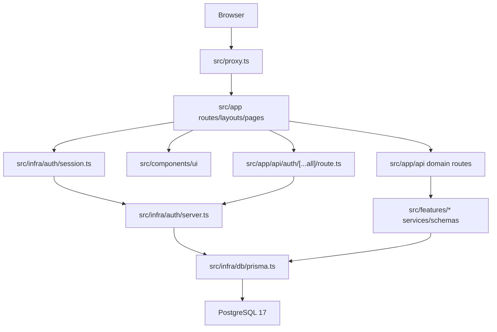
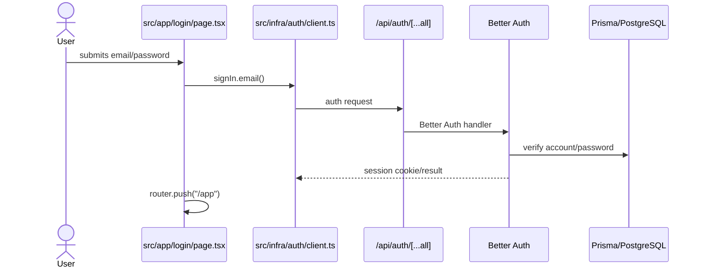
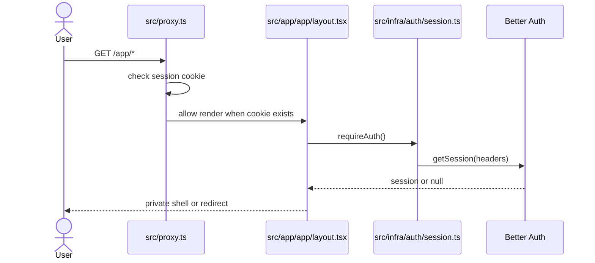
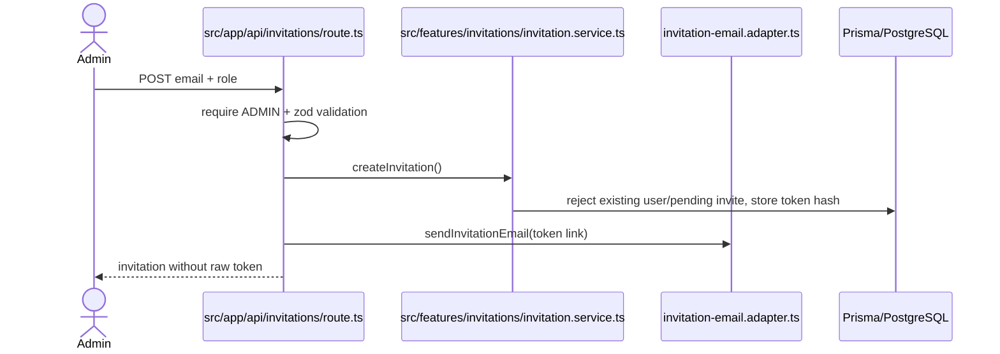

# Architecture

**Analyzed:** 2026-05-28

**Pattern:** Modular Next.js monolith with App Router route boundaries, centralized auth/session helpers, Prisma data access, and feature folders for domain behavior.

## High-Level Structure

## Identified Patterns

### App Router Route Segments

**Location:** `src/app`
**Purpose:** UI routing, layouts, public/private route separation.
**Implementation:** Public pages live at root routes such as `src/app/page.tsx` and `src/app/login/page.tsx`; authenticated pages live below `src/app/app`.
**Example:** `src/app/app/layout.tsx` requires authentication once and wraps all private child pages.

### Optimistic Proxy Protection

**Location:** `src/proxy.ts`
**Purpose:** Redirect obvious unauthenticated private route access before rendering.
**Implementation:** `getSessionCookie(request)` checks for a Better Auth session cookie. `/app/:path*` redirects to `/login` without a cookie; `/login` redirects to `/app` when a session cookie exists.
**Example:** `config.matcher = ["/app/:path*", "/login"]`.

### Server-Side Authorization Helpers

**Location:** `src/infra/auth/session.ts`
**Purpose:** Centralize real session lookup and role authorization.
**Implementation:** `getCurrentSession()` calls `auth.api.getSession` with `next/headers`; `requireAuth()` redirects to `/login`; `requireRole(role)` redirects unauthorized users to `/app`.
**Example:** `src/app/app/admin/page.tsx` calls `requireRole("ADMIN")`.

### API-Level Role Checks

**Location:** `src/app/api/**/route.ts` and `src/infra/auth/authorization.ts`
**Purpose:** Protect mutation and JSON read boundaries independently from page visibility.
**Implementation:** Route handlers call `auth.api.getSession({ headers })` and then `hasRole()` before validation or mutation. Admin routes protect invitations; teacher routes protect subject fields and questions.
**Example:** `src/app/api/questions/route.ts` rejects non-teachers with `{ success: false, error: "UNAUTHORIZED" }`.

### Feature Service + Schema Modules

**Location:** `src/features`
**Purpose:** Keep domain rules and validation outside App Router files.
**Implementation:** Each feature has a `*.schema.ts` with Zod validation and a `*.service.ts` with Prisma mutations/query helpers and domain errors.
**Example:** `src/features/questions/question.service.ts` validates input, checks subject-field existence, writes question alternatives in a transaction, and maps Prisma errors to `QuestionDomainError`.

### Better Auth Route Handler

**Location:** `src/app/api/auth/[...all]/route.ts`
**Purpose:** Expose Better Auth HTTP endpoints to Next.js.
**Implementation:** `toNextJsHandler(auth)` exports `GET` and `POST`.
**Example:** Login uses `signIn.email` from `src/infra/auth/client.ts`, which talks to these endpoints.

### Prisma Client Singleton

**Location:** `src/infra/db/prisma.ts`
**Purpose:** Provide one Prisma client, reusing it during development reloads.
**Implementation:** Uses `PrismaPg` adapter and stores the client on `global` outside production.
**Example:** `scripts/seed-users.ts` imports `prisma` from `@infra/db/prisma`.

### shadcn-Style UI Components

**Location:** `src/components/ui`
**Purpose:** Reusable UI primitives aligned with shadcn conventions.
**Implementation:** Components use `React.forwardRef`, `cn`, Radix primitives where applicable, and `class-variance-authority` for variants.
**Example:** `src/components/ui/button.tsx` exports `Button` and `buttonVariants`.

### Dynamic Markdown Editor Wrapper

**Location:** `src/components/markdown/markdown-editor.tsx`
**Purpose:** Provide browser-only rich Markdown editing without server-rendering MDXEditor.
**Implementation:** Uses `next/dynamic` with `ssr: false`, imports `@mdxeditor/editor/style.css`, and exposes a controlled `MarkdownEditor` wrapper with a `resetKey` sync hook.
**Example:** Question forms consume this editor for Markdown statement and alternative fields.

## Data Flow

### Login Flow

### Private Page Access

### E2E Test Flow

`playwright.config.ts` runs `src/tests/e2e/global-setup.ts`, which loads `.env.test`, runs `pnpm e2e:prepare`, creates the test database if missing, deploys migrations, and seeds deterministic users. The web server builds and starts Next on port `3001`.

### Invitation Flow

### Teacher Content Flow

Teachers manage subject fields and questions through `/app/professor/**` pages backed by `/api/subject-fields/**` and `/api/questions/**`. UI forms use `react-hook-form` plus Zod schemas from `src/features`; API routes re-run trusted validation, enforce `TEACHER`, and call service functions that own Prisma writes.

## Code Organization

**Approach:** Layered by framework area plus product feature folders. Auth and infrastructure remain centralized; product behavior lives in `src/features` with route/page adapters in `src/app`.

**Structure:**

- `src/app`: App Router pages, layouts, and route handlers
- `src/infra/auth`: Better Auth config, client, session helpers, role constants, unit tests
- `src/components/ui`: shadcn-style primitives
- `src/features`: invitation, subject-field, and question schemas/services/tests
- `src/infra/db`: Prisma client infrastructure
- `src/tests`: setup and E2E test suite
- `scripts`: seed and E2E database/server orchestration
- `prisma`: schema and migrations

**Feature boundaries:** Auth and database helpers are imported through TypeScript aliases (`@auth/*`, `@infra/*`, `@prisma-generated-client`, `@/*`). UI primitives are local and imported from `@/components/ui/*`. Feature folders under `src/features` expose schemas, services, domain errors, and colocated unit tests; App Router files act as thin UI/API adapters.
