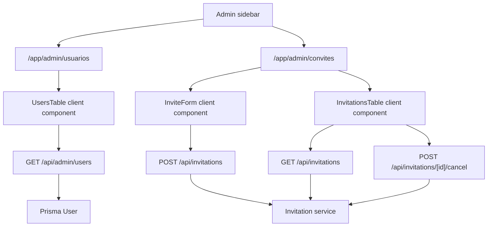

# Admin Access Management Design

**Spec**: `.specs/features/admin-access-management/spec.md`
**Status**: Draft

---

## Architecture Overview

This feature reorganizes the existing admin management surface without changing the invitation domain model. The current combined `/app/admin` page becomes either a small hub or redirect, while two protected routes own their focused workflows:

- `/app/admin/usuarios`: users table only.
- `/app/admin/convites`: create-invitation form plus invitations table.

Read APIs should become paginated and table-oriented. Mutations remain thin Next.js Route Handlers that authorize internally and call feature services. Client tables use TanStack Query for request state/cache/refetch and TanStack Table for pagination/sorting UI.



Next.js 16 local docs note that Route Handlers should live under `app/` for HTTP endpoints and server-side authorization must happen in mutation/data boundaries. This design keeps that pattern.

---

## Code Reuse Analysis

### Existing Components to Leverage

| Component | Location | How to Use |
| --- | --- | --- |
| Admin route protection | `src/infra/auth/session.ts` | Use `requireRole("ADMIN")` in admin pages. |
| API authorization pattern | `src/app/api/invitations/route.ts` | Keep `auth.api.getSession({ headers: await headers() })` + `hasRole(session, "ADMIN")` in admin APIs. |
| Existing invite form | `src/app/app/admin/_components/invite-form.tsx` | Move or reuse under the invitations page, then inject query invalidation behavior on success. |
| Existing invitations table | `src/app/app/admin/_components/invitations-table.tsx` | Replace local `useState` list with Query + Table pagination/sorting. |
| Ranking table pagination pattern | `src/app/app/professor/ranking/_components/ranking-table.tsx` | Reuse manual TanStack Table pagination/sorting structure and page-size controls. |
| Ranking query schema/service pattern | `src/features/simulation-ranking/*` | Mirror `page`, `pageSize`, `sort`, `direction`, `rowCount`, `pageCount`. |
| shadcn primitives | `src/components/ui/*` | Use `Table`, `Button`, `Badge`, `Alert`, `Field`, `InputGroup`, `Card` where appropriate. |
| HTTP client | `src/infra/http/client.ts` | Use existing `ky` instance for form mutations and Query fetchers where it fits. |
| Sidebar | `src/app/app/app-sidebar.tsx` | Split ADMIN nav item into Usuarios and Convites. |

### Integration Points

| System | Integration Method |
| --- | --- |
| TanStack Query | Add `@tanstack/react-query` dependency if still absent, then add a client QueryProvider under the private app layout. |
| TanStack Table | Use existing installed `@tanstack/react-table` with manual pagination and sorting. |
| Better Auth | Keep page/API authorization server-side with existing helpers and session APIs. |
| Prisma | Add paginated read helpers around `User` and `Invitation`; no schema migration expected. |
| Playwright | Extend admin/invitations E2E coverage and add sidebar/users assertions. |

---

## Components

### Query Provider

- **Purpose**: Provide a React Query client to client components inside the logged-in app.
- **Location**: `src/app/app/_components/query-provider.tsx` or `src/components/query-provider.tsx`
- **Interfaces**:
  - `QueryProvider({ children }: { children: React.ReactNode })`
- **Dependencies**: `@tanstack/react-query`
- **Reuses**: Existing private app layout structure in `src/app/app/layout.tsx`.

### Admin Users Query Schema and Service

- **Purpose**: Validate table query params and return a paginated users page.
- **Location**: `src/features/admin-users/admin-user.schema.ts`, `src/features/admin-users/admin-user.service.ts`
- **Interfaces**:
  - `adminUsersQuerySchema`
  - `listAdminUsers(input): Promise<{ rows; rowCount; page; pageSize; pageCount }>`
- **Dependencies**: Prisma, Zod.
- **Reuses**: Ranking pagination schema/service pattern.

### Admin Users API

- **Purpose**: Serve paginated user rows to the users table.
- **Location**: `src/app/api/admin/users/route.ts`
- **Interfaces**:
  - `GET /api/admin/users?page=&pageSize=&sort=&direction=`
- **Dependencies**: Better Auth session, `hasRole`, admin users schema/service.
- **Reuses**: Existing admin API authorization pattern.

### Paginated Invitations Query

- **Purpose**: Replace unpaginated pending invitation listing with a paginated service/API response.
- **Location**: `src/features/invitations/invitation.schema.ts`, `src/features/invitations/invitation.service.ts`, `src/app/api/invitations/route.ts`
- **Interfaces**:
  - `invitationListQuerySchema`
  - `listPendingInvitationsPage(input): Promise<{ rows; rowCount; page; pageSize; pageCount }>`
  - `GET /api/invitations?page=&pageSize=&sort=&direction=`
- **Dependencies**: Existing invitation model/service.
- **Reuses**: Existing `listPendingInvitations` behavior and ranking pagination response shape.

### Users Page

- **Purpose**: Render only the registered users management surface.
- **Location**: `src/app/app/admin/usuarios/page.tsx`, `src/app/app/admin/usuarios/_components/users-table.tsx`
- **Interfaces**:
  - Server page enforces `requireRole("ADMIN")`.
  - Client `UsersTable` owns table state and Query calls.
- **Dependencies**: QueryProvider, admin users API, shadcn table primitives.
- **Reuses**: Ranking table interaction pattern.

### Invitations Page

- **Purpose**: Render invitation creation and paginated pending invitation management.
- **Location**: `src/app/app/admin/convites/page.tsx`, route-local components as needed.
- **Interfaces**:
  - Server page enforces `requireRole("ADMIN")`.
  - `InviteForm` accepts optional `onCreated` callback or invalidates a shared query key directly.
  - `InvitationsTable` owns table state and Query calls.
- **Dependencies**: QueryProvider, invitations API, existing invitation form/schema.
- **Reuses**: Existing form and cancellation behavior, but moves list truth to Query cache/server.

### Admin Landing

- **Purpose**: Preserve `/app/admin` after splitting routes.
- **Location**: `src/app/app/admin/page.tsx`
- **Interfaces**:
  - Either `redirect("/app/admin/usuarios")` after `requireRole("ADMIN")`, or a compact hub with two links.
- **Dependencies**: Next navigation or shadcn cards/buttons.
- **Reuses**: Existing protected page pattern.

### Sidebar Navigation

- **Purpose**: Expose distinct admin pages.
- **Location**: `src/app/app/app-sidebar.tsx`
- **Interfaces**:
  - ADMIN nav items become `/app/admin/usuarios` and `/app/admin/convites`.
- **Dependencies**: lucide icons.
- **Reuses**: Existing `ROLE_NAV_ITEMS` and `isActivePath`.

---

## Data Models

No Prisma schema changes are expected.

### AdminUserRow

```typescript
interface AdminUserRow {
  id: string;
  name: string | null;
  email: string;
  role: "ADMIN" | "TEACHER" | "STUDENT";
  createdAt: string;
}
```

### InvitationRow

```typescript
interface InvitationRow {
  id: string;
  email: string;
  role: "TEACHER" | "STUDENT";
  status: "PENDING";
  createdAt: string;
}
```

### Page Response

```typescript
interface PaginatedResponse<Row> {
  success: true;
  rows: Row[];
  rowCount: number;
  page: number;
  pageSize: number;
  pageCount: number;
}
```

---

## Error Handling Strategy

| Error Scenario | Handling | User Impact |
| --- | --- | --- |
| Non-admin page access | `requireRole("ADMIN")` redirects/denies as existing app does. | User cannot see admin pages. |
| Non-admin API access | API returns `{ success: false, error: "UNAUTHORIZED" }` with 401. | Table shows a load error if somehow reached. |
| Invalid table params | API returns validation error with 400. | Table shows generic load failure; developer can inspect details. |
| Users/invitations fetch fails | Query error state renders destructive `Alert` with retry. | User sees failure and can retry. |
| Create invitation conflict | Existing form maps domain codes to friendly messages. | User knows whether account/invite already exists. |
| Create invitation succeeds | Invalidate/refetch invitations query and optionally reset pagination to newest-first first page. | New invite appears immediately below. |
| Cancel invitation succeeds | Invalidate/refetch invitations query. | Cancelled invite disappears from pending list or updates state. |

---

## Tech Decisions

| Decision | Choice | Rationale |
| --- | --- | --- |
| Query library | Add/use `@tanstack/react-query` | User explicitly requested react-query; project currently has TanStack Table but not Query dependency. |
| Pagination owner | Server/API pagination with manual table state | Keeps large lists scalable and mirrors existing ranking example. |
| Users API location | `GET /api/admin/users` | Avoids overloading invitation endpoint with unrelated user data. |
| Invitations API shape | Keep `GET /api/invitations`, but paginate and return rows metadata | Reuses existing endpoint while matching table requirements. |
| Post-create refresh | Invalidate `["admin", "invitations", ...]` query key and reset/refetch page 1 | Guarantees newly-created newest invite appears immediately. |
| Admin landing | Prefer redirect to `/app/admin/usuarios` unless product wants a hub | Keeps old route useful with minimal UI. |

---

## Risks and Mitigations

- `@tanstack/react-query` is not currently listed in `package.json`; implementation must install it and verify lockfile/build.
- Current `GET /api/invitations` returns both users and invitations; changing it can affect existing E2E/helpers, so update tests/helpers together.
- E2E DB state is not reset between runs; invitation tests must use unique emails and/or deterministic cleanup helpers.
- QueryProvider placement should be inside the private app layout to avoid adding client behavior to the root public layout unnecessarily.
