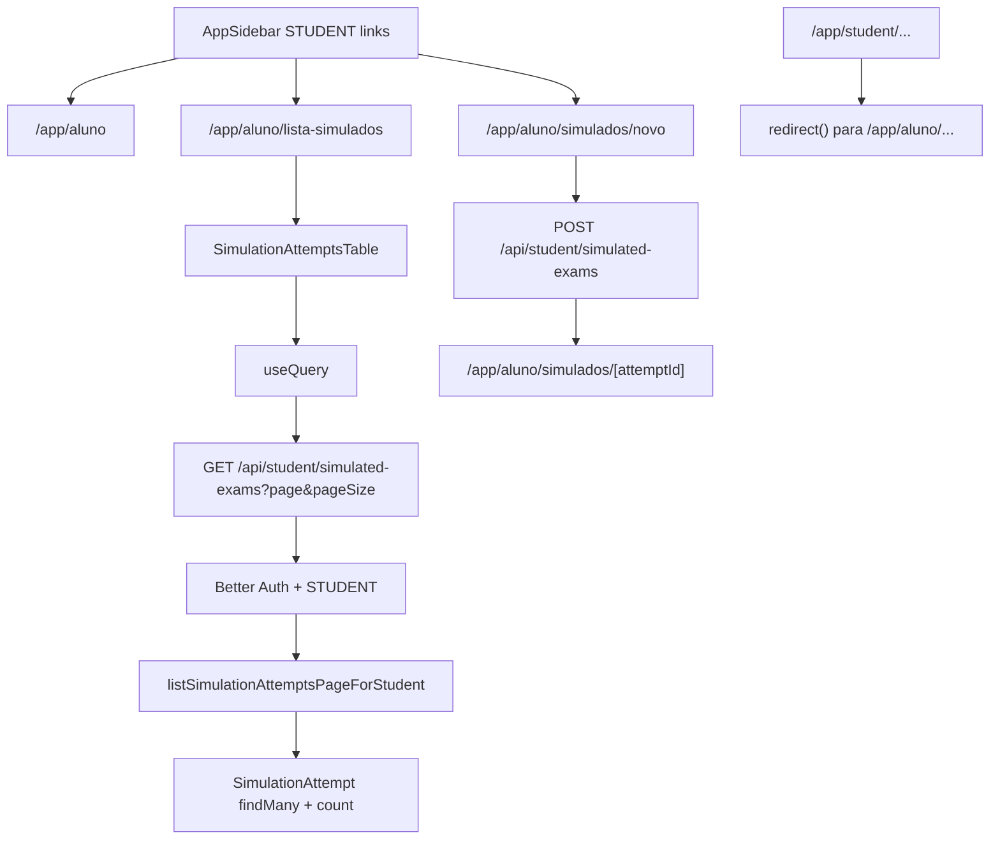

# Organização das Telas de Aluno e Lista de Simulados Design

**Spec**: `.specs/features/aluno-simulados-navigation-list/spec.md`
**Status**: Implemented

---

## Architecture Overview

A implementação deve tornar `/app/aluno` a superfície canônica de UI do estudante. As páginas reais ficam no novo segmento, enquanto o segmento antigo `/app/student` fica como compatibilidade por redirect. A listagem deixa de ser Server Component com `findMany` direto e passa a ser uma Client Component com React Query + TanStack React Table, consumindo uma API `GET` paginada protegida por `STUDENT`.



> `mermaid-studio` is not installed, so this plan uses inline Mermaid.

---

## Code Reuse Analysis

### Existing Components and Patterns to Leverage

| Component/Pattern | Location | How to Use |
| --- | --- | --- |
| Existing student simulation pages | `src/app/app/student/simulados/*` | Move/copy as canonical `/aluno` pages, then replace old pages with redirects. |
| Role protection | `src/infra/auth/session.ts` | Keep `requireRole("STUDENT")` in all aluno pages. |
| Existing APIs | `src/app/api/student/simulated-exams/*` | Keep mutation API path stable; add `GET` to collection route for paginated list. |
| Existing service | `src/features/simulated-exams/simulated-exam.service.ts` | Extend with paginated list function and DTO. |
| Ranking table pattern | `src/app/app/professor/ranking/_components/ranking-table.tsx` | Reuse table, manual pagination, states and shadcn Table structure; replace `useEffect` fetch with React Query. |
| shadcn primitives | `src/components/ui/*` | Use `Table`, `Button`, `Badge`, `Alert`, `Skeleton`/existing loading patterns. |
| E2E simulated exams | `src/tests/e2e/student-simulated-exams.spec.ts` | Update expected routes/texts and add redirect/list action assertions. |

### Integration Points

| System | Integration Method |
| --- | --- |
| Next.js App Router | New file-system routes under `src/app/app/aluno`; legacy routes call `redirect()`. |
| Better Auth | Pages and API continue checking `STUDENT`. |
| Prisma | Paginated read uses `simulationAttempt.findMany({ where: { studentId }, skip, take })` plus count. |
| React Query | Add `@tanstack/react-query`; provide `QueryClientProvider` under private shell or route-local provider. |
| TanStack Table | Use `manualPagination: true`, controlled pagination state and `rowCount/pageCount` from backend. |

---

## Components

### Aluno Pages

- **Purpose**: Canonical student UI routes in Portuguese.
- **Location**:
  - `src/app/app/aluno/page.tsx`
  - `src/app/app/aluno/lista-simulados/page.tsx`
  - `src/app/app/aluno/simulados/novo/page.tsx`
  - `src/app/app/aluno/simulados/[attemptId]/page.tsx`
- **Dependencies**: `requireRole("STUDENT")`, existing simulation service, private layout.
- **Reuses**: Existing student page content and attempt view component.

### Legacy Student Redirect Pages

- **Purpose**: Keep old bookmarks and E2E deep links from breaking.
- **Location**:
  - `src/app/app/student/page.tsx`
  - `src/app/app/student/simulados/page.tsx`
  - `src/app/app/student/simulados/novo/page.tsx`
  - `src/app/app/student/simulados/[attemptId]/page.tsx`
- **Behavior**:
  - `/app/student` -> `/app/aluno`
  - `/app/student/simulados` -> `/app/aluno/lista-simulados`
  - `/app/student/simulados/novo` -> `/app/aluno/simulados/novo`
  - `/app/student/simulados/[attemptId]` -> `/app/aluno/simulados/[attemptId]`

### Student Navigation

- **Purpose**: Expose Portuguese student links in sidebar.
- **Location**: `src/app/app/app-sidebar.tsx`
- **Changes**:
  - `/app/student` -> `/app/aluno`
  - `/app/student/simulados/novo` -> `/app/aluno/simulados/novo`
  - `/app/student/simulados` -> `/app/aluno/lista-simulados`
  - Label "Histórico" -> "Lista de simulados"; icon can stay `History` or change to `ClipboardList`.

### React Query Provider

- **Purpose**: Enable React Query client components under logged-in app.
- **Location**: `src/app/app/query-provider.tsx` or `src/components/query-provider.tsx`
- **Interface**:
  - `QueryProvider({ children }: { children: React.ReactNode })`
- **Integration**: Wrap `children` in `src/app/app/layout.tsx` inside the private shell.
- **Dependency**: `@tanstack/react-query`.

### Paginated Attempts Schema

- **Purpose**: Validate list query params.
- **Location**: `src/features/simulated-exams/simulated-exam.schema.ts`
- **Interface**:
  - `simulationAttemptsListQuerySchema`
  - `SimulationAttemptsListQuery`
  - `ParsedSimulationAttemptsListQuery`
- **Rules**:
  - `page`: integer >= 1, default 1.
  - `pageSize`: integer 10..100, default 20.

### Paginated Attempts Service

- **Purpose**: Return safe, paginated attempt summaries for one student.
- **Location**: `src/features/simulated-exams/simulated-exam.service.ts`
- **Interface**:
  - `listSimulationAttemptsPageForStudent(studentId, input): Promise<SimulationAttemptsPage>`
- **DTO**:

```typescript
interface SimulationAttemptListRow {
  id: string
  status: "IN_PROGRESS" | "COMPLETED"
  totalQuestions: number
  answeredCount: number
  correctCount: number
  wrongCount: number
  scorePercent: number
  startedAt: Date
  completedAt: Date | null
  subjectFields: Array<{ id: string; title: string; colorHex: string }>
}

interface SimulationAttemptsPage {
  rows: SimulationAttemptListRow[]
  rowCount: number
  page: number
  pageSize: number
  pageCount: number
}
```

### API GET List

- **Purpose**: Thin backend-for-frontend endpoint for the React Query table.
- **Location**: `src/app/api/student/simulated-exams/route.ts`
- **Interface**:
  - `GET /api/student/simulated-exams?page=1&pageSize=20`
- **Rules**: Require `STUDENT`; parse query with Zod; return `{ success: true, rows, rowCount, page, pageSize, pageCount }`.

### Simulation Attempts Table

- **Purpose**: Render "Lista de simulados" with server pagination.
- **Location**: `src/app/app/aluno/lista-simulados/_components/simulation-attempts-table.tsx`
- **Dependencies**: `@tanstack/react-query`, `@tanstack/react-table`, shadcn `Table`, `Button`, `Badge`, `Alert`.
- **Columns**:
  - Status
  - Grandes áreas
  - Início (`createdAt` formatted as date + time, labeled in UI as "Início")
  - Finalização (`completedAt` formatted as date + time or "Ainda em andamento")
  - Progresso/resultado
  - Ação (`Retomar e finalizar` for `IN_PROGRESS`, `Revisar resultado` for `COMPLETED`)
- **Behavior**:
  - `manualPagination: true`.
  - `useQuery` key includes `pageIndex` and `pageSize`.
  - On error, show `Alert` with retry action.
  - On empty state, show CTA to `/app/aluno/simulados/novo`.

### Generation Screen Improvements

- **Purpose**: Small UX polish without domain expansion.
- **Location**:
  - `src/app/app/aluno/simulados/novo/page.tsx`
  - `src/app/app/aluno/simulados/_components/simulation-generate-form.tsx`
- **Changes**:
  - Link back to `/app/aluno/lista-simulados`.
  - POST remains `/api/student/simulated-exams`.
  - After creation route to `/app/aluno/simulados/[attemptId]`.
  - Show selected areas count and available question total for selected areas.
  - Keep server validation as source of truth.

---

## Error Handling Strategy

| Error Scenario | Handling | User Impact |
| --- | --- | --- |
| Unauthorized list API | Return `401` with `{ success: false, error: "UNAUTHORIZED" }` | Table shows load error if session expires; protected pages usually redirect first. |
| Invalid pagination params | Return `400` with `VALIDATION_ERROR` | Table can reset to page 1 or show error. |
| List API network/server error | React Query exposes error | Show destructive `Alert` with retry. |
| No attempts | API returns empty `rows` and `rowCount: 0` | Empty state with CTA "Gerar simulado". |
| Legacy URL visited | Next `redirect()` | User lands on canonical Portuguese URL. |

---

## Tech Decisions

| Decision | Choice | Rationale |
| --- | --- | --- |
| UI route prefix | `/app/aluno` | Matches Portuguese app vocabulary and explicit user request. |
| List route | `/app/aluno/lista-simulados` | Matches user suggestion and avoids "historico". |
| Old UI routes | Redirect, not delete | Guarantees bookmarks/tests/deep links do not 404 during transition. |
| API path | Keep `/api/student/simulated-exams` | Request says telas; preserving API avoids churn and keeps existing mutation clients safe. |
| React Query package | `@tanstack/react-query` | Current React Query package for React apps. |
| Table package | Existing `@tanstack/react-table` | Already installed and used in teacher ranking. |
| Pagination | Backend/manual pagination | Required by user and avoids loading all attempts. |

---

## Notes From Current Code

- Current list page is [src/app/app/student/simulados/page.tsx](/Users/porto/.codex/worktrees/786b/enade-eng-prod/src/app/app/student/simulados/page.tsx) and calls `listSimulationAttemptsForStudent()` directly.
- Current service list function is not paginated: [src/features/simulated-exams/simulated-exam.service.ts](/Users/porto/.codex/worktrees/786b/enade-eng-prod/src/features/simulated-exams/simulated-exam.service.ts).
- Existing ranking table provides a close TanStack Table pattern: [src/app/app/professor/ranking/_components/ranking-table.tsx](/Users/porto/.codex/worktrees/786b/enade-eng-prod/src/app/app/professor/ranking/_components/ranking-table.tsx).
- Next.js 16 docs confirm App Router routes are file-system segments and route handlers live in `app` with supported `GET` methods.
