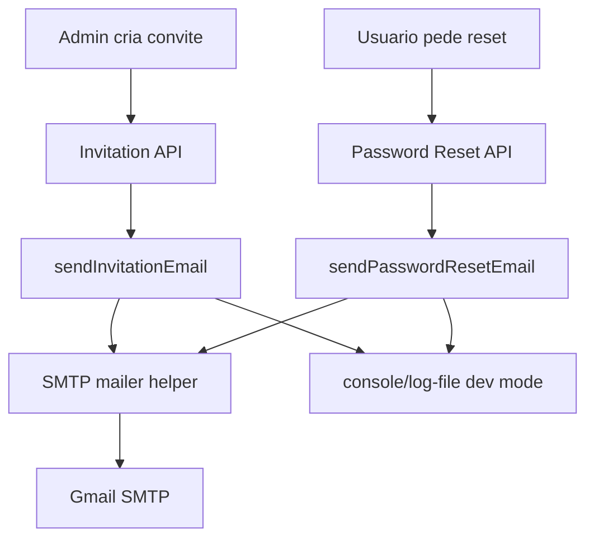

# Gmail SMTP Email Design

**Spec**: `.specs/features/gmail-smtp-email/spec.md`
**Status**: Draft

---

## Architecture Overview

Implementar um helper SMTP compartilhado em infra e manter os adapters de convite/reset como donos do conteudo do email. Os fluxos existentes continuam chamando `sendInvitationEmail()` e `sendPasswordResetEmail()`; somente o branch `smtp` passa a entregar email real.

---

## Research Notes

- Google Account Help confirma que app passwords exigem 2-Step Verification e sao uma senha de 16 digitos para apps/dispositivos.
- Google Workspace Help lista `smtp.gmail.com` como Gmail SMTP server, com porta `465` para SSL e `587` para TLS, autenticando com email completo e app password.
- Google alerta que app passwords podem nao estar disponiveis para contas de organizacao, contas com Advanced Protection ou configuracoes especificas de 2-Step Verification.

---

## Code Reuse Analysis

### Existing Components to Leverage

| Component | Location | How to Use |
| --- | --- | --- |
| Invitation email adapter | `src/features/invitations/invitation-email.adapter.ts` | Preservar URL builder e modo `console`; trocar apenas branch `smtp`. |
| Password reset email adapter | `src/features/password-reset/password-reset-email.adapter.ts` | Preservar URL builder e modo `console`; trocar apenas branch `smtp`. |
| Env schema | `src/infra/env.ts` | Reusar `SMTP_*` existentes; refinar validacao/conversao onde necessario. |
| App base URL | `src/infra/url/app-base-url.ts` | Continuar gerando links absolutos a partir de `NEXT_PUBLIC_URL`/`VERCEL_URL`. |
| Tests atuais dos adapters | `src/features/**/**email.adapter.test.ts` | Expandir para cobrir envio SMTP mockado e validacoes. |

### Integration Points

| System | Integration Method |
| --- | --- |
| Gmail SMTP | SMTP autenticado via `smtp.gmail.com`, app password e TLS/SSL. |
| Convites | `POST /api/invitations` ja chama o adapter apos criar token. |
| Reset de senha | `requestPasswordReset()` ja chama o adapter apos persistir token. |
| E2E | Continua usando `console` + log-file para capturar links deterministicamente. |

---

## Components

### SMTP Mailer Helper

- **Purpose**: Encapsular criacao de transport SMTP e envio de emails transacionais.
- **Location**: `src/infra/email/smtp-mailer.ts`
- **Interfaces**:
  - `sendSmtpEmail(input: SendSmtpEmailInput): Promise<void>` - envia `from`, `to`, `subject`, `text`, `html`.
  - `getSmtpConfig(): SmtpConfig` - valida/converte envs e retorna config segura.
- **Dependencies**: `env`, biblioteca SMTP, tipagem local.
- **Reuses**: Padrao de infra server-only ja usado em storage/db/auth.

### Invitation Email Adapter

- **Purpose**: Montar assunto/corpo do convite e delegar entrega SMTP quando configurada.
- **Location**: `src/features/invitations/invitation-email.adapter.ts`
- **Interfaces**:
  - `sendInvitationEmail(input): Promise<void>`
  - `buildInvitationUrl(token): string`
- **Dependencies**: `sendSmtpEmail`, `env`, `getAppBaseUrl`.
- **Reuses**: Branch `console` existente.

### Password Reset Email Adapter

- **Purpose**: Montar assunto/corpo do reset e delegar entrega SMTP quando configurada.
- **Location**: `src/features/password-reset/password-reset-email.adapter.ts`
- **Interfaces**:
  - `sendPasswordResetEmail(input): Promise<void>`
  - `buildPasswordResetUrl(token): string`
- **Dependencies**: `sendSmtpEmail`, `env`, `getAppBaseUrl`.
- **Reuses**: Branch `console` existente.

### Env Contract

- **Purpose**: Garantir que config SMTP seja previsivel e documentada.
- **Location**: `src/infra/env.ts`, `.env.example`
- **Interfaces**:
  - `SMTP_HOST`, `SMTP_PORT`, `SMTP_USER`, `SMTP_PASSWORD`, `SMTP_SECURE`.
- **Dependencies**: `@t3-oss/env-nextjs`, `zod`.
- **Reuses**: `optionalTrimmedString`, `booleanString`.

---

## Error Handling Strategy

| Error Scenario | Handling | User Impact |
| --- | --- | --- |
| Env SMTP ausente | Helper lança `Missing SMTP_* for SMTP delivery.` | Convite: rota falha; reset: API retorna `PASSWORD_RESET_DELIVERY_ERROR`. |
| Porta invalida | Helper lança erro de configuracao antes de tentar envio. | Falha clara em teste/build/manual smoke. |
| Gmail rejeita autenticacao | Biblioteca SMTP propaga erro; adapter nao loga segredo. | Operador corrige senha de app/politica da conta. |
| Conta inexistente no reset | Comportamento atual: nao envia e resposta publica segue generica. | Usuario nao descobre existencia da conta. |
| `console` em dev/E2E | Branch atual preservado. | Testes continuam deterministicos. |

---

## Tech Decisions

| Decision | Choice | Rationale |
| --- | --- | --- |
| Biblioteca SMTP | `nodemailer` | Biblioteca comum e direta para SMTP; evita implementar protocolo manualmente. |
| Helper compartilhado | `src/infra/email/smtp-mailer.ts` | Remove duplicacao entre convite e reset sem misturar templates. |
| Gmail porta default | `465` + `SMTP_SECURE=true` | E a combinacao SSL mais simples para Gmail SMTP. |
| E2E | Manter `console`/log-file | Envio real em E2E seria lento, fragil e dependente de rede/credenciais. |
| Templates | Texto + HTML simples | Suficiente para links funcionais e melhora legibilidade sem criar sistema de template. |

---

## Security Notes

- `SMTP_PASSWORD` deve ser senha de app, nao senha principal da conta Google.
- Nunca registrar `SMTP_PASSWORD`, token cru ou URL de reset/convite em logs publicos de producao.
- A conta remetente deve ter acesso restrito e recuperacao configurada.
- Se o projeto passar a ter maior volume de emails, reavaliar Gmail SMTP contra provedor transacional dedicado.
