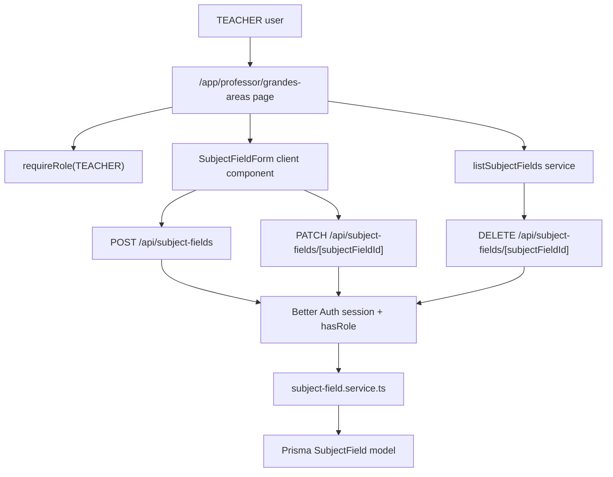

# Grandes Areas Design

**Spec**: `.specs/features/grandes-areas/spec.md`
**Status**: Draft

---

## Architecture Overview

The feature follows the existing modular Next.js monolith pattern: server-rendered teacher page protected by `requireRole("TEACHER")`, a small feature service under `src/features/subject-fields`, Prisma persistence, and route handlers as form-friendly mutation boundaries. Database entities, code symbols, file names, and API route paths use English, while front-facing page route paths and visible UI text use Portuguese. The UI keeps the create form above the list on the same page and uses shadcn-style primitives already present in the project.



---

## Code Reuse Analysis

### Existing Components to Leverage

| Component/Pattern | Location | How to Use |
| --- | --- | --- |
| Teacher role page protection | `src/app/app/teacher/page.tsx` | Reuse `requireRole("TEACHER")` on the management page. |
| Admin CRUD-ish page composition | `src/app/app/admin/page.tsx` | Follow the pattern of server page fetching data and rendering form above list cards. |
| Form stack | `src/app/app/admin/_components/invite-form.tsx` | Reuse `react-hook-form`, `zodResolver`, `Alert`, `Button`, `Input`, `Label`, and fetch-based JSON handling. |
| API authorization pattern | `src/app/api/invitations/route.ts` | Authorize inside route handlers with `auth.api.getSession` and `hasRole`, independent of UI visibility. |
| Feature folder pattern | `src/features/invitations/*` | Create English-named schema/service/tests under a dedicated feature folder. |
| Test helpers | `src/tests/e2e/helpers/auth.ts` | Reuse `loginAs` and deterministic seed users. |

### Integration Points

| System | Integration Method |
| --- | --- |
| Prisma/PostgreSQL | Add `SubjectField` model and migration, generate Prisma client. |
| Better Auth roles | Require `TEACHER` for page access and all mutations. |
| App Router | Add Portuguese front route segment under `src/app/app/professor/grandes-areas/page.tsx` and English API handlers under `src/app/api/subject-fields`. |
| E2E test DB | Add deterministic cleanup for `SubjectField` records in the new E2E flow or shared helper to avoid state leakage. |

---

## Components

### SubjectField Prisma Model

- **Purpose**: Persist broad academic groupings created by teachers.
- **Location**: `prisma/schema.prisma`, `prisma/migrations/*`
- **Fields**:
  - `id: string`
  - `title: string`
  - `titleNormalized: string`
  - `description: string`
  - `colorHex: string`
  - `createdById: string`
  - `createdAt: Date`
  - `updatedAt: Date`
- **Relationships**: `createdBy` points to `User`; future English-named subject/course-content model can reference `SubjectField`.
- **Indexes/Constraints**: unique `titleNormalized` across the whole catalog; index `updatedAt`; index `createdById`.
- **Reuses**: Existing `User` model and Prisma migration pattern.

### Subject Field Schema

- **Purpose**: Validate create/update inputs consistently on client and server.
- **Location**: `src/features/subject-fields/subject-field.schema.ts`
- **Interfaces**:
  - `subjectFieldInputSchema` validates `{ title, description, colorHex }`
  - `subjectFieldIdSchema` validates route ids
  - exported inferred input types for forms/services
- **Dependencies**: `zod`
- **Reuses**: Zod normalization style from `src/features/invitations/invitation.schema.ts`

### Subject Field Service

- **Purpose**: Own domain rules for list, create, and update.
- **Location**: `src/features/subject-fields/subject-field.service.ts`
- **Interfaces**:
  - `listSubjectFields(): Promise<SubjectFieldListItem[]>`
  - `createSubjectField(input, actorUserId): Promise<SubjectField>`
  - `updateSubjectField(id, input, actorUserId): Promise<SubjectField>`
  - `deleteSubjectField(id, actorUserId): Promise<SubjectField>`
- **Dependencies**: Prisma client, Zod schemas.
- **Reuses**: Error-class pattern from invitation service.

### Subject Fields API Routes

- **Purpose**: Provide form-friendly JSON mutation boundaries with trusted authorization.
- **Location**:
  - `src/app/api/subject-fields/route.ts`
  - `src/app/api/subject-fields/[subjectFieldId]/route.ts`
- **Interfaces**:
  - `POST /api/subject-fields` creates a grande area.
  - `PATCH /api/subject-fields/[subjectFieldId]` updates a grande area.
  - `DELETE /api/subject-fields/[subjectFieldId]` deletes a grande area.
- **Dependencies**: `auth.api.getSession`, `hasRole`, schemas, service.
- **Reuses**: Invitation route handler response style.
- **Testing**: Route handlers are not covered by individual `route.test.ts` files; authorization, success, validation-facing behavior, and destructive delete confirmation are covered through the T8 browser E2E flow, while service/domain rules stay covered by service unit tests.

### Teacher Management Page

- **Purpose**: Render page title, create form, and existing grande areas list for teachers.
- **Location**: `src/app/app/professor/grandes-areas/page.tsx`
- **Dependencies**: `requireRole("TEACHER")`, `listSubjectFields`, UI primitives.
- **Reuses**: `Card`, `Badge`, and route-local `_components` pattern.

### Subject Field Form

- **Purpose**: Handle create and edit form state with client-side validation and feedback.
- **Location**: `src/app/app/professor/grandes-areas/_components/subject-field-form.tsx`
- **Dependencies**: `react-hook-form`, `@hookform/resolvers/zod`, feature schema, UI primitives.
- **Reuses**: Invite form interaction pattern.

### Subject Fields List

- **Purpose**: Show existing records, empty state, color swatches, edit controls, and delete controls for all records.
- **Location**: `src/app/app/professor/grandes-areas/_components/subject-fields-list.tsx`
- **Dependencies**: Subject field list DTO, form component for edit mode.
- **Reuses**: Existing card/list styling vocabulary.
- **Delete behavior**: Uses a confirmation step before calling `DELETE /api/subject-fields/[subjectFieldId]`; confirmed deletion removes the item from local state and refreshes server data.

---

## Data Models

### SubjectField

```typescript
interface SubjectField {
  id: string
  title: string
  titleNormalized: string
  description: string
  colorHex: string
  createdById: string
  createdAt: Date
  updatedAt: Date
}
```

**Relationships**: `createdById` references `User.id`. The model intentionally has no subject relation yet, but is ready for a future English-named subject model such as `Subject.subjectFieldId`.

### SubjectFieldInput

```typescript
interface SubjectFieldInput {
  title: string
  description: string
  colorHex: `#${string}`
}
```

**Validation rules**:

- `title`: trim, collapse repeated whitespace, min 2, max 120.
- `description`: trim, min 10, max 500.
- `colorHex`: uppercase normalized `#RRGGBB`; reject shorthand and invalid hex.
- `titleNormalized`: derived from title as lowercase whitespace-normalized string for catalog-wide uniqueness.

---

## Error Handling Strategy

| Error Scenario | Handling | User Impact |
| --- | --- | --- |
| Invalid form data | Zod validation in client and route handler | Field/form feedback asks for correction. |
| Duplicate title | Service throws `SUBJECT_FIELD_TITLE_EXISTS` and database unique constraint protects concurrent writes | Form shows a specific duplicate title message. |
| Unauthorized user | Page redirects via `requireRole`; API returns `401` | Student/admin cannot access or mutate. |
| Non-teacher edit | API authorization returns `401` | Student/admin cannot mutate data. |
| Non-teacher delete | API authorization returns `401` | Student/admin cannot mutate data. |
| Missing record | Service throws `SUBJECT_FIELD_NOT_FOUND` | UI can show failure and refresh list. |
| Concurrent duplicate create | DB unique constraint plus service mapping | One request succeeds; the other gets duplicate error. |

---

## Tech Decisions

| Decision | Choice | Rationale |
| --- | --- | --- |
| Visibility | Teachers list all grandes areas | The prompt asks for existing grandes areas and helps prevent duplicate academic umbrellas. |
| Edit permission | Any authenticated `TEACHER` can edit any grande area | Matches the requested shared professor catalog workflow. |
| Delete permission | Any authenticated `TEACHER` can delete any grande area after confirmation | Matches the new requested shared professor catalog workflow while guarding destructive action. |
| Technical naming language | Database entities, variables, types, file names, feature folders, and API routes in English; front routes and visible UI text in Portuguese | Keeps code/API boundaries conventional while matching user-facing Portuguese navigation. |
| Duplicate strategy | Catalog-wide unique `titleNormalized` | Enforces that two grandes areas cannot have the same title, including casing/spacing variations. |
| Color format | Store normalized uppercase `#RRGGBB` | Simple, predictable, and directly renderable in UI. |
| Delete support | Enabled with explicit confirmation | The user requested deletion now; future materia relations may later require blocking or soft-delete rules. |

---

## Notes for Implementation

- Before editing Next.js route/page code, read the relevant Next.js 16 docs in `node_modules/next/dist/docs/` as required by `AGENTS.md`.
- The `CONCERNS.md` P1 about mutation authorization applies here: every API handler must authorize internally.
- Do not add individual unit tests for `src/app/api/subject-fields/**/route.ts`; use service unit tests for domain rules and T8 E2E for route behavior.
- The `CONCERNS.md` P1 about E2E database leakage applies here: the E2E test must clean deterministic `SubjectField` rows it creates.
