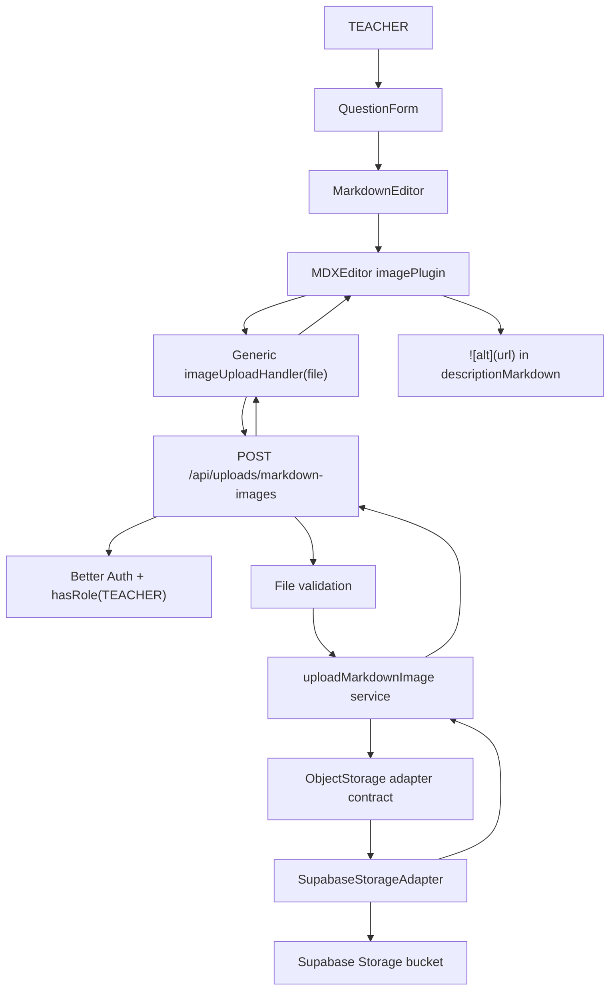

# Markdown Image Upload Design

**Spec**: `.specs/features/markdown-image-upload/spec.md`
**Status**: Implemented pending E2E/final gates

---

## Research Notes

- Existing code wraps `@mdxeditor/editor` in `src/components/markdown/markdown-editor.tsx`; route forms should consume this wrapper instead of importing MDXEditor directly.
- The installed MDXEditor package exports `imagePlugin`, `InsertImage`, and `ImageUploadHandler = (image: File) => Promise<string>`, so the editor can receive a generic upload handler and insert the returned URL.
- Next.js 16 route handlers use Web `Request`/`Response`; docs show request bodies can be read with `request.formData()`. Dynamic route params are promises, so any future dynamic upload route must `await context.params`.
- Supabase Storage JavaScript docs expose `.storage.from(bucket).upload(path, fileBody, options)` and note that the bucket must already exist. Standard uploads are suitable for small files; Supabase recommends resumable/TUS when files exceed 6MB.
- Supabase docs warn against overwriting files because CDN propagation can cause stale content, so the app should generate unique object keys and upload with `upsert: false`.

Sources used:

- `node_modules/@mdxeditor/editor/dist/index.d.ts`
- `node_modules/next/dist/docs/01-app/03-api-reference/03-file-conventions/route.md`
- `node_modules/next/dist/docs/01-app/02-guides/backend-for-frontend.md`
- https://supabase.com/docs/reference/javascript/storage-from-upload
- https://supabase.com/docs/guides/storage/uploads/standard-uploads

---

## Architecture Overview

The editor remains provider-agnostic. It receives an optional `imageUploadHandler` prop and passes it to MDXEditor's `imagePlugin`. The question form provides a small client upload function that posts `multipart/form-data` to `/api/uploads/markdown-images`. The route authenticates the user as TEACHER, validates the file, and calls a feature service. The service depends on a storage adapter contract; the Supabase implementation lives in infra and returns a persistent public URL plus object metadata.



Note: `mermaid-studio` is not installed in this session, so this uses inline Mermaid.

---

## Code Reuse Analysis

### Existing Components to Leverage

| Component/Pattern | Location | How to Use |
| --- | --- | --- |
| Markdown wrapper | `src/components/markdown/markdown-editor.tsx` | Extend with optional image upload props and `imagePlugin`; keep MDXEditor details isolated. |
| Question form | `src/app/app/professor/questoes/_components/question-form.tsx` | Provide the upload handler for the description editor. |
| API auth pattern | `src/app/api/questions/route.ts` | Reuse `auth.api.getSession({ headers: await headers() })`, `hasRole`, and JSON error shape. |
| Dynamic route typing pattern | `src/app/api/questions/[questionId]/route.ts` | Keep Next 16 `RouteContext` awareness if dynamic upload routes are added later. |
| Feature service tests | `src/features/questions/*.test.ts` | Mock adapters and assert domain errors at service boundary. |
| E2E helpers | `src/tests/e2e/helpers/auth.ts`, `src/tests/e2e/helpers/questions.ts` | Reuse login and question creation/edit patterns. |

### Integration Points

| System | Integration Method |
| --- | --- |
| MDXEditor | Add `editor.imagePlugin({ imageUploadHandler })` and `editor.InsertImage` to toolbar only when upload is configured. |
| App Router API | Add `POST /api/uploads/markdown-images` reading `request.formData()`. |
| Better Auth | Require authenticated `TEACHER` before validation/upload. |
| Supabase Storage | Add `@supabase/supabase-js`, server-only client factory, bucket/path config env vars, and adapter. Required envs: `SUPABASE_URL`, `SUPABASE_SECRET_KEY`, `SUPABASE_STORAGE_BUCKET`, `SUPABASE_STORAGE_PUBLIC_URL`. |
| Question markdown | Store returned URL in existing `Question.descriptionMarkdown`; no schema change needed. |

---

## Components

### Markdown Image Upload Handler Type

- **Purpose**: Keep editor contract generic and testable.
- **Location**: `src/components/markdown/markdown-editor.tsx` or `src/components/markdown/types.ts`
- **Interfaces**:
  - `type MarkdownImageUploadHandler = (file: File) => Promise<string>`
  - `MarkdownEditorProps.imageUploadHandler?: MarkdownImageUploadHandler`
- **Dependencies**: Browser `File`, MDXEditor `imagePlugin`.
- **Reuses**: Existing markdown wrapper.

### Markdown Editor Wrapper Extension

- **Purpose**: Enable image insertion while hiding MDXEditor and provider details from forms.
- **Location**: `src/components/markdown/markdown-editor.tsx`
- **Interfaces**:
  - Existing `value`, `onChange`, `onBlur`, `resetKey`, `ariaLabel`, `className`
  - New optional `imageUploadHandler`
- **Dependencies**: `@mdxeditor/editor` `imagePlugin`, `InsertImage`, existing toolbar plugins.
- **Reuses**: Current dynamic import and `ssr: false` pattern.

### Client Upload Function

- **Purpose**: Convert a browser `File` into a call to the app upload API.
- **Location**: `src/app/app/professor/questoes/_components/question-image-upload.ts` or colocated helper if small.
- **Interfaces**:
  - `uploadQuestionMarkdownImage(file: File): Promise<string>`
- **Dependencies**: `fetch`, `FormData`.
- **Reuses**: Existing fetch-based form/API style.

### Upload Schema And Validation

- **Purpose**: Centralize allowed MIME types, max size and safe metadata rules.
- **Location**: `src/features/uploads/markdown-image.schema.ts`, `src/features/uploads/markdown-image.schema.test.ts`
- **Interfaces**:
  - `ALLOWED_MARKDOWN_IMAGE_TYPES`
  - `MAX_MARKDOWN_IMAGE_BYTES`
  - `validateMarkdownImageFile(fileLike): MarkdownImageFile`
  - `createMarkdownImageObjectKey(input): string`
- **Dependencies**: `zod` for non-File metadata where useful; direct checks for `File`.
- **Reuses**: Feature schema naming and test colocations.

### Upload Service

- **Purpose**: Own domain-level upload validation, safe object key generation and error mapping.
- **Location**: `src/features/uploads/markdown-image.service.ts`, `src/features/uploads/markdown-image.service.test.ts`
- **Interfaces**:
  - `uploadMarkdownImage(input, storage = defaultMarkdownImageStorage): Promise<MarkdownImageUploadResult>`
  - `MarkdownImageUploadResult { url: string; key: string; contentType: string; size: number }`
  - `MarkdownImageUploadDomainError`
- **Dependencies**: Storage adapter port.
- **Reuses**: Domain error class style from questions/subject fields.

### Object Storage Adapter Port

- **Purpose**: Abstract provider-specific upload implementation.
- **Location**: `src/features/uploads/object-storage.ts`
- **Interfaces**:
  - `ObjectStorageAdapter.uploadObject(input): Promise<StoredObject>`
  - `StoredObject { key: string; url: string; contentType: string; size: number }`
- **Dependencies**: None provider-specific.
- **Reuses**: Adapter-boundary pattern similar to invitation email adapter.

### Supabase Storage Adapter

- **Purpose**: Implement the object storage port using Supabase Storage.
- **Location**: `src/infra/storage/supabase-storage.adapter.ts`, `src/infra/storage/supabase.ts`
- **Interfaces**:
  - `createSupabaseStorageClient()`
  - `supabaseMarkdownImageStorage: ObjectStorageAdapter`
- **Dependencies**: `@supabase/supabase-js`, server env vars: `SUPABASE_URL`, `SUPABASE_SECRET_KEY`, `SUPABASE_STORAGE_BUCKET`, `SUPABASE_STORAGE_PUBLIC_URL`.
- **Reuses**: Existing infra folder convention.

### Upload Route Handler

- **Purpose**: Expose a protected multipart upload boundary.
- **Location**: `src/app/api/uploads/markdown-images/route.ts`
- **Interfaces**:
  - `POST /api/uploads/markdown-images`
  - Response success: `{ success: true, image: { url, key, contentType, size } }`
  - Response failure: `{ success: false, error, issues? }`
- **Dependencies**: Better Auth, upload service.
- **Reuses**: API response/auth style from question routes.

---

## Data Models

No Prisma model change is required for MVP. The image URL is embedded in existing markdown text.

```typescript
interface MarkdownImageUploadResult {
  url: string
  key: string
  contentType: "image/png" | "image/jpeg" | "image/webp" | "image/gif"
  size: number
}

interface ObjectStorageUploadInput {
  key: string
  body: Blob | ArrayBuffer | Uint8Array
  contentType: string
  cacheControl?: string
}

interface ObjectStorageAdapter {
  uploadObject(input: ObjectStorageUploadInput): Promise<MarkdownImageUploadResult>
}
```

---

## Error Handling Strategy

| Error Scenario | Handling | User Impact |
| --- | --- | --- |
| Anonymous or non-teacher upload | Route returns `UNAUTHORIZED` 401 before reading/storing file. | Editor shows upload failed. |
| Missing file field | Route returns `VALIDATION_ERROR` 400. | Editor shows upload failed. |
| Disallowed MIME type | Service returns `VALIDATION_ERROR` 400. | User is told file type is unsupported. |
| Oversized image | Service returns `VALIDATION_ERROR` 400. | User is told image is too large. |
| Missing Supabase env | Adapter throws config error; route maps to `STORAGE_CONFIG_ERROR` 500. | User sees generic upload failure; server log has config detail. |
| Supabase upload error | Adapter maps provider error to `STORAGE_UPLOAD_ERROR` 502/500. | User can retry without seeing provider internals. |

---

## Tech Decisions

| Decision | Choice | Rationale |
| --- | --- | --- |
| Editor/provider coupling | Inject `imageUploadHandler` into `MarkdownEditor` | Satisfies requirement that component knows nothing about Supabase. |
| Storage boundary | Feature-owned `ObjectStorageAdapter` port, infra Supabase adapter | Keeps domain/test contract stable if provider changes. |
| Upload endpoint | App route `/api/uploads/markdown-images` with `multipart/form-data` | Fits browser `File` upload and Next 16 Request APIs. |
| File types | PNG, JPEG, WebP, GIF; reject SVG | Covers common raster needs while reducing XSS/CSP risk. |
| Size limit | Fixed 6MB max for MVP | Aligns with Supabase guidance that standard upload is ideal for files not larger than 6MB. |
| Object keys | Unique generated key under a configured prefix; `upsert: false` | Avoids overwrites and stale CDN propagation. |
| URL inserted | Persistent URL from storage adapter | Allows markdown to remain renderable after save/reload. |
