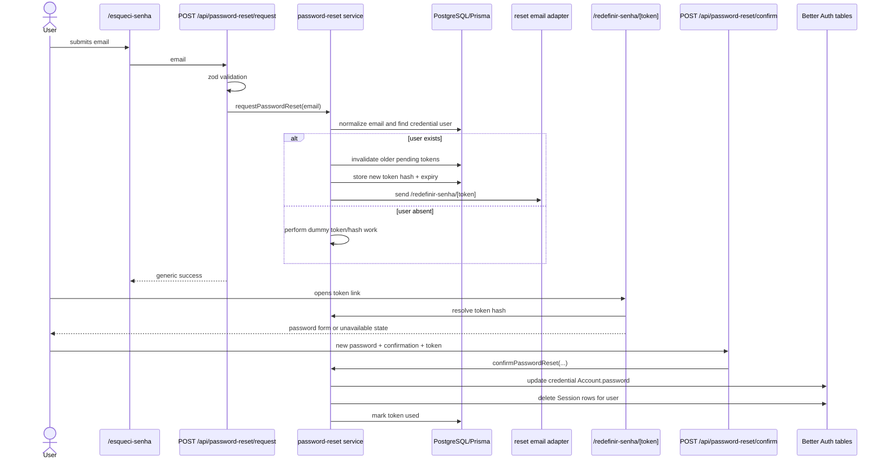

# Password Reset Design

**Spec**: `.specs/features/password-reset/spec.md`
**Status**: Draft

---

## Recommendation

Do not use Better Auth's built-in password reset endpoints as the product flow.

Use a first-party password reset feature that owns token lifecycle, routes, UI, email delivery, and tests, while reusing Better Auth-compatible password hashing and the existing `Account(providerId: "credential")` schema. This mirrors the already-completed invitation feature: Better Auth remains the session/login engine, but product-specific public account flows stay in the application domain.

Why:

- The project already disabled public signup and deliberately created invited users through application services.
- The installed Better Auth reset flow depends on `emailAndPassword.sendResetPassword` and stores reset values in generic `Verification` records.
- A local feature can use Portuguese routes (`/esqueci-senha`, `/redefinir-senha/[token]`), deterministic E2E log files, shadcn UI, and the same token-hash pattern as convites.
- Keeping reset in `src/features/password-reset` makes security rules testable without coupling product UX to generated `/api/auth/*` routes.

What to reuse from Better Auth:

- `hashPassword` from `better-auth/crypto`, matching the invitation acceptance and seed-user pattern.
- Existing `User`, `Account`, and `Session` tables generated for Better Auth.
- Optional reference behavior from Better Auth: generic public success for unknown email, one-hour default expiry, and session revocation after reset.

What not to reuse:

- Built-in `/api/auth/request-password-reset` and `/api/auth/reset-password` as the main user-facing contract.
- Better Auth `Verification` as the domain token store.
- Better Auth generated reset URL shape.

---

## Codebase Alignment

- Auth config: `src/infra/auth/server.ts` keeps `emailAndPassword.disableSignUp: true`; no need to enable `sendResetPassword`.
- Account creation pattern: `src/features/invitations/invitation.service.ts` and `scripts/seed-users.ts` use `hashPassword` plus credential `Account`.
- Token pattern: `src/features/invitations/invitation-token.service.ts` already uses secure random `base64url` tokens and SHA-256 hashes.
- Email delivery pattern: `src/features/invitations/invitation-email.adapter.ts` provides console/log-file behavior and future SMTP boundary.
- API boundary: Route Handlers authorize/validate server-side and call feature services; public reset routes validate and map errors without leaking account existence.
- UI pattern: `react-hook-form`, `zodResolver`, shadcn `Card`, `Input`, `Label`, `Button`, `Alert`.

Before implementation, read the relevant Next.js 16 docs in `node_modules/next/dist/docs/` for App Router dynamic routes, Route Handlers, and mutating data.

---

## Architecture



No `mermaid-studio` skill is installed in this session, so this design uses inline Mermaid.

---

## Data Model

Add a standalone reset-token model rather than reusing Better Auth `Verification`.

```prisma
enum PasswordResetTokenStatus {
  PENDING
  USED
  CANCELLED
  EXPIRED
}

model PasswordResetToken {
  id        String                   @id @default(cuid())
  userId    String
  user      User                     @relation(fields: [userId], references: [id], onDelete: Cascade)
  tokenHash String                   @unique
  status    PasswordResetTokenStatus @default(PENDING)
  expiresAt DateTime
  createdAt DateTime                 @default(now())
  updatedAt DateTime                 @updatedAt
  usedAt    DateTime?

  @@index([userId, status])
  @@index([status, expiresAt])
}
```

Implementation note: adding the `User.passwordResetTokens` relation is optional for Prisma ergonomics but useful for cleanup and tests.

Expiry recommendation: 1 hour, matching Better Auth's default reset token expiry unless product decides otherwise.

---

## Components

### Password Reset Token Service

**Location**: `src/features/password-reset/password-reset-token.service.ts`

**Purpose**: Generate raw tokens and hash tokens for lookup.

**Interfaces**

- `generatePasswordResetToken(): string`
- `hashPasswordResetToken(token: string): string`

**Reuses**: Invitation token implementation; consider extracting a shared token helper only if duplication grows beyond the two feature services.

### Password Reset Schemas

**Location**: `src/features/password-reset/password-reset.schema.ts`

**Interfaces**

- `requestPasswordResetSchema`: `{ email }`
- `confirmPasswordResetSchema`: `{ token, password, passwordConfirmation }`

Validation:

- Email trims and lowercases.
- Password minimum stays aligned with invitation acceptance: at least 8 characters.
- Confirmation must match.

### Password Reset Service

**Location**: `src/features/password-reset/password-reset.service.ts`

**Interfaces**

- `requestPasswordReset(input): Promise<{ sent: boolean }>`
- `resolvePasswordResetToken(token): Promise<ResolvedPasswordResetToken>`
- `confirmPasswordReset(input): Promise<void>`

Responsibilities:

- Normalize email and avoid public enumeration.
- Only create tokens for users that have a credential account.
- Invalidate older pending tokens for the same user.
- Store only token hashes.
- Update `Account.password` for `providerId: "credential"` using `hashPassword`.
- Mark token as used transactionally.
- Delete `Session` rows for the user after successful reset.

Domain errors:

- `PASSWORD_RESET_TOKEN_NOT_FOUND`
- `PASSWORD_RESET_TOKEN_NOT_PENDING`
- `PASSWORD_RESET_TOKEN_EXPIRED`
- `PASSWORD_RESET_ACCOUNT_NOT_CREDENTIAL`

Public routes should map these to generic user-facing states where appropriate.

### Password Reset Email Adapter

**Location**: `src/features/password-reset/password-reset-email.adapter.ts`

**Interfaces**

- `buildPasswordResetUrl(token: string): string`
- `sendPasswordResetEmail(input: { email: string; token: string }): Promise<void>`

The reset email adapter must follow the invitation testing shape: `console` delivery logs structured email data and, when log-file envs are configured, appends one JSON line to an untracked local file. In E2E, this file should live under `./e2e-fixtures/tmp/`, matching `.env.test` invitation behavior and the existing `.gitignore` rule `/e2e-fixtures/**/*`.

Recommendation: duplicate the small invitation delivery shape with reset-specific env names for the first implementation. Extract a generic local `src/infra/email/console-email.adapter.ts` only if invitation and reset delivery logic start drifting or if a real provider is introduced.

Env options:

- Use `PASSWORD_RESET_EMAIL_LOG_DIR=./e2e-fixtures/tmp/` and `PASSWORD_RESET_EMAIL_LOG_FILE_NAME=enade-eng-prod-password-reset.log` in `.env.test`.
- Keep the reset log file untracked by relying on the existing `/e2e-fixtures/**/*` ignore rule.
- Reuse `INVITATION_EMAIL_DELIVERY` only if the team wants one delivery mode for all transactional emails; otherwise add `TRANSACTIONAL_EMAIL_DELIVERY` in a later cleanup.

### API Routes

**Locations**

- `src/app/api/password-reset/request/route.ts`
- `src/app/api/password-reset/confirm/route.ts`

Responsibilities:

- Parse JSON.
- Validate with Zod.
- Call service.
- Return generic success for request flow.
- Return field/form-safe errors for invalid password or invalid token.

No authenticated session is required; these are public routes, so they must be conservative about messages.

### Public Pages

**Locations**

- `src/app/esqueci-senha/page.tsx`
- `src/app/esqueci-senha/_components/request-password-reset-form.tsx`
- `src/app/redefinir-senha/[token]/page.tsx`
- `src/app/redefinir-senha/[token]/_components/confirm-password-reset-form.tsx`

Behavior:

- Forgot-password page presents an email form and neutral success state.
- Reset page resolves the token server-side before showing the form.
- Invalid/expired/used tokens render a generic unavailable state.
- Successful reset navigates or links back to `/login`.
- Login page gets a small "Esqueci minha senha" link.

---

## Security Notes

- Token raw value appears only in email/log output and URL.
- Database stores only SHA-256 hashes.
- Public request endpoint should have generic response for known and unknown email.
- Session revocation should delete rows in `Session` for the affected user.
- Reset confirmation should run in a transaction to avoid token reuse races.
- Add deterministic cleanup for E2E users/tokens; E2E database is not reset between runs.
- Do not rely on `src/proxy.ts`; reset routes are public.

---

## Alternatives Considered

| Option | Pros | Cons | Decision |
| --- | --- | --- | --- |
| Use Better Auth built-in reset endpoints | Less code; library handles token verification and password update. | Generated route shape, generic `Verification`, product/UI coupling to auth endpoints, separate email callback config. | Rejected for now. |
| Fully custom reset including custom password hashing | Maximum control. | Risky and unnecessary because Better Auth already owns credential password format. | Rejected. |
| First-party reset with Better Auth-compatible hash/account/session tables | Product-owned UX and token lifecycle; consistent with convites; still compatible with login engine. | More code and tests than built-in flow. | Recommended. |

---

## Open Decisions

- Exact reset token expiry: recommended 1 hour.
- Whether to add reset-specific env names or introduce a generic transactional email config.
- Whether reset success should auto-redirect to login or show a success page with a button.
- Whether a successful reset should send a security notification email after password change.
