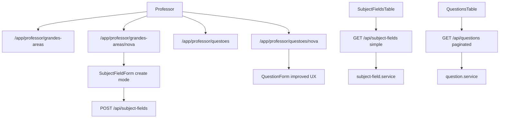

# Professor Content Organization Design

**Spec**: `.specs/features/professor-content-organization/spec.md`
**Status**: Draft

---

## Architecture Overview

Separar a area do professor em rotas mais especificas, mantendo os services de dominio atuais para mutacoes. As leituras que hoje acontecem server-side nas paginas de listagem passam a ter endpoints `GET` consumidos por React Query; grandes areas usam leitura simples sem paginacao, enquanto questoes usam leitura paginada. As tabelas usam React Table e componentes shadcn `Table`, seguindo o padrao visual ja usado no ranking, sem alterar os arquivos do ranking.



---

## Code Reuse Analysis

### Existing Components to Leverage

| Component | Location | How to Use |
| --- | --- | --- |
| `SubjectFieldForm` | `src/app/app/professor/grandes-areas/_components/subject-field-form.tsx` | Reuse create/edit behavior, add redirect support after create and improve shadcn field ergonomics. |
| `QuestionForm` | `src/app/app/professor/questoes/_components/question-form.tsx` | Keep API payload and validation, reorganize layout into clearer sections. |
| `RankingTable` pattern | `src/app/app/professor/ranking/_components/ranking-table.tsx` | Reuse React Table column/pagination/sort concepts, but do not edit ranking files. |
| `Table` primitives | `src/components/ui/table.tsx` | Render both listagens with shadcn table vocabulary. |
| `Alert`, `Button`, `Badge`, `Card` | `src/components/ui/*` | Preserve existing visual system and feedback states. |
| `sonner` toaster | `src/components/ui/sonner.tsx` and app layout | Use for transient success/error feedback from submissions and mutations. |
| Shared API client | `src/infra/http/client.ts` | Prefer for React Query fetchers if it fits existing client-side usage; otherwise use local typed `fetch` wrappers. |

### Integration Points

| System | Integration Method |
| --- | --- |
| Subject fields API | Add simple unpaginated `GET /api/subject-fields` while preserving current `POST`. |
| Questions API | Add paginated `GET /api/questions` while preserving current `POST`. |
| Auth/AuthZ | Keep `requireRole("TEACHER")` on pages and `auth.api.getSession` + `hasRole(..., "TEACHER")` on route handlers. |
| React Query | Add provider under the authenticated app shell or a small client provider used by the professor list pages. |
| Sidebar | Add/create route links only if needed; keep ranking link and route untouched. |

---

## Components

### Subject Field Create Page

- **Purpose**: Render only the large-area creation flow.
- **Location**: `src/app/app/professor/grandes-areas/nova/page.tsx`
- **Interfaces**:
  - Uses `SubjectFieldForm` with `afterSaveHref="/app/professor/grandes-areas"`.
- **Dependencies**: `requireRole("TEACHER")`, existing subject-field API.
- **Reuses**: Current form and shadcn card/page header style.

### Subject Fields List Page

- **Purpose**: Render the subject-field table and primary action to create.
- **Location**: `src/app/app/professor/grandes-areas/page.tsx`
- **Interfaces**:
  - Renders `SubjectFieldsTable`.
- **Dependencies**: React Query provider, `GET /api/subject-fields`.
- **Reuses**: Current route, teacher page protection, ranking table interaction patterns.

### Subject Fields Table

- **Purpose**: Display subject fields with client-side table interactions and edit/delete actions.
- **Location**: `src/app/app/professor/grandes-areas/_components/subject-fields-table.tsx`
- **Interfaces**:
  - API response: `{ success, rows }`.
- **Dependencies**: `@tanstack/react-table`, `@tanstack/react-query`, subject-field DELETE/PATCH routes.
- **Reuses**: Edit form inline or dialog-like section from current `SubjectFieldsList`; delete confirmation copy, cascade awareness.

### Question Form UX Refresh

- **Purpose**: Make the existing question form easier to scan and complete.
- **Location**: `src/app/app/professor/questoes/_components/question-form.tsx`
- **Interfaces**:
  - Preserve `QuestionFormProps`, `QuestionInput` and existing save behavior.
- **Dependencies**: `react-hook-form`, `zodResolver`, `MarkdownEditor`, existing upload handler.
- **Reuses**: Current validation schema, markdown image upload, alternative array behavior.

### Questions Table

- **Purpose**: Display questions in a paginated table with edit/delete actions.
- **Location**: `src/app/app/professor/questoes/_components/questions-table.tsx`
- **Interfaces**:
  - Internal query params: `page`, `pageSize`, `sort`, `direction`.
  - API response: `{ success, rows, rowCount, page, pageSize, pageCount }`.
- **Dependencies**: `@tanstack/react-table`, `@tanstack/react-query`, question DELETE route.
- **Reuses**: `plainPreview`, metadata labels, delete confirmation flow from current `QuestionsList`.

### Query Provider

- **Purpose**: Provide a `QueryClient` for client-side list pages.
- **Location**: Prefer `src/app/app/query-provider.tsx` or a provider composed in `src/app/app/layout.tsx`.
- **Interfaces**:
  - `QueryProvider({ children }: { children: React.ReactNode })`.
- **Dependencies**: `@tanstack/react-query`.
- **Reuses**: Existing app layout shell; no provider should wrap public auth pages unless necessary.

---

## Data Models

### Subject Fields Response

```typescript
type SubjectFieldsResponse = {
  success: true;
  rows: SubjectFieldListItem[];
};
```

Sorting/filtering for grandes areas can happen client-side in React Table because the API is intentionally unpaginated.

### Paginated Questions Response

```typescript
type QuestionsResponse = {
  success: true;
  rows: QuestionListItem[];
  rowCount: number;
  page: number;
  pageSize: number;
  pageCount: number;
};
```

Questions use server-side pagination. Sorting should initially support stable columns that map directly to Prisma fields or relations safely verified during implementation, such as `updatedAt`, `year`, `difficulty`, and `subjectField`.

---

## Error Handling Strategy

| Error Scenario | Handling | User Impact |
| --- | --- | --- |
| Unauthorized list API call | Return `{ success: false, error: "UNAUTHORIZED" }` with 401 | UI shows load error or page protection prevents reaching it. |
| Invalid question pagination params | Validate with Zod query schema and fallback or 400 | UI can show friendly "Nao foi possivel carregar". |
| Subject-field duplicate title | Preserve current domain error mapping | Form shows existing duplicate message. |
| Delete fails | Preserve current confirmation + destructive alert | Row remains visible and user can retry. |
| React Query load fails | Table-level alert with retry | User sees failure without page crash. |
| Create/update/delete succeeds or fails | Trigger `toast.success` / `toast.error` from `sonner` | User receives immediate transient feedback without extra inline success blocks. |

---

## Tech Decisions

| Decision | Choice | Rationale |
| --- | --- | --- |
| React Query dependency | Add `@tanstack/react-query` | Requested stack requires it and package is not installed today. |
| Subject fields pagination | No pagination in `GET /api/subject-fields` | User clarified grandes areas do not need pagination. |
| Questions pagination | Server-side pagination in `GET /api/questions` | User clarified question listing must be paginated. |
| Ranking | No file changes under `src/app/app/professor/ranking` or ranking feature/API | User explicitly said ranking is good and should not change. |
| Form UX | Reorganize components without changing schemas or service payloads | Keeps validated business logic stable while improving usability. |
| Feedback mechanism | Use `sonner` for success/error feedback from form submissions and row mutations | Matches user preference and existing dependency/UI setup. |

---

## UI/UX Notes From Recon

- Grandes areas currently mixes creation and listing in `src/app/app/professor/grandes-areas/page.tsx`; split this first.
- `SubjectFieldForm` already has robust validation and save logic, but should support post-create redirect for the dedicated create page.
- `QuestionForm` is functionally complete but visually long. Improvements should prioritize sections, clearer alternative state, less visual density, and better empty prerequisite guidance.
- `QuestionsList` and `SubjectFieldsList` are card-based with local state. Replace list rendering with table components and React Query invalidation after mutations.
- Existing forms use inline `Alert` for success/error; this feature should move submission/mutation success and error feedback to `sonner`, keeping inline field validation messages near controls.
- Avoid nested/floating card excess; use page header plus a single table/form surface where possible.
