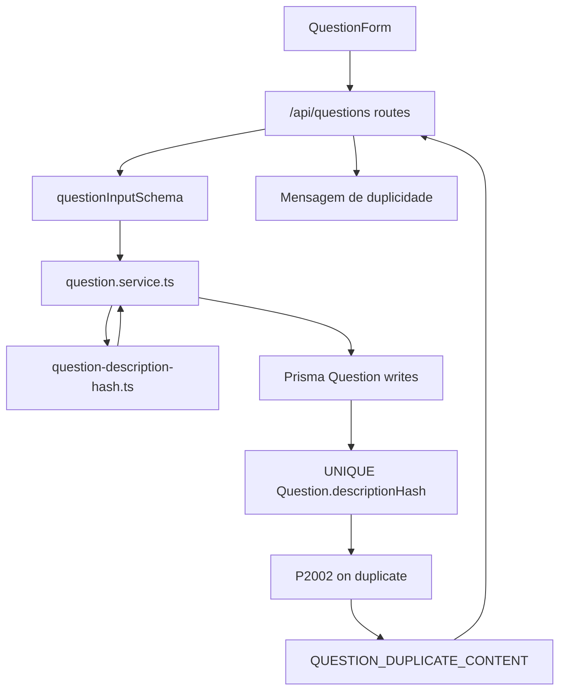

# Question Deduplication Design

**Spec**: `.specs/features/question-deduplication/spec.md`
**Status**: Complete

---

## Research Notes

- Existing `Question.id` is `String @id @default(cuid())` in `prisma/schema.prisma`, so it is already stable and content-independent.
- Existing question validation trims `descriptionMarkdown` in `src/features/questions/question.schema.ts`.
- Existing create/update logic already centralizes mutations in `src/features/questions/question.service.ts`, which is the right place to compute and persist deduplication hashes.
- Existing API route handlers map `QuestionDomainError` codes to form-friendly JSON, so duplicate errors should follow that pattern.
- `.specs/codebase/CONCERNS.md` flags missing question E2E coverage and non-reset E2E state; this feature should use deterministic test data cleanup.
- Next.js 16 docs are not directly needed for the hash/service work unless route handler behavior is changed. If API routes are edited beyond error mapping, check `node_modules/next/dist/docs/` first per `AGENTS.md`.

---

## Architecture Overview

Question deduplication is a domain invariant enforced in two places: the service computes a canonical SHA-256 hash for accepted question input, and the database enforces uniqueness with a unique index on `Question.descriptionHash`. The UI remains thin: it submits the same form payload and renders a domain-specific duplicate message when the API returns `QUESTION_DUPLICATE_CONTENT`.



---

## Code Reuse Analysis

### Existing Components to Leverage

| Component/Pattern | Location | How to Use |
| --- | --- | --- |
| Question schema normalization | `src/features/questions/question.schema.ts` | Keep validation first; hash only parsed `descriptionMarkdown`. |
| Question service write flow | `src/features/questions/question.service.ts` | Add hash computation to `questionData` and map unique errors. |
| Question service tests | `src/features/questions/question.service.test.ts` | Extend existing mocked Prisma tests for duplicate create/update. |
| Question schema tests | `src/features/questions/question.schema.test.ts` | Keep schema-focused tests; add hash tests in a dedicated helper test instead of overloading schema tests. |
| API route error mapping | `src/app/api/questions/route.ts`, `src/app/api/questions/[questionId]/route.ts` | Map `QUESTION_DUPLICATE_CONTENT` to conflict-style form JSON. |
| Question form error rendering | `src/app/app/professor/questoes/_components/question-form.tsx` | Add friendly duplicate message while preserving form state. |
| E2E question helpers | `src/tests/e2e/helpers/questions.ts` | Reuse deterministic cleanup/creation helpers for duplicate-flow coverage. |

### Integration Points

| System | Integration Method |
| --- | --- |
| Prisma/PostgreSQL | Add `Question.descriptionHash String @unique` and migration/backfill. |
| Node crypto | Use built-in SHA-256 hashing; no new runtime dependency required. |
| Question create/update service | Compute hash from parsed/canonical markdown and persist on every write. |
| API routes | Preserve existing JSON response shape and expose stable duplicate error code. |
| Browser UI | Display a Portuguese error message for duplicate content without clearing the draft. |
| Tests | Unit coverage for hash helper/service mapping; E2E coverage for visible duplicate prevention. |

---

## Components

### Question Content Hash Helper

- **Purpose**: Produce deterministic canonical text and SHA-256 hashes for question deduplication.
- **Location**: `src/features/questions/question-description-hash.ts`
- **Interfaces**:
  - `normalizeQuestionMarkdownForHash(markdown: string): string`
  - `createQuestionDescriptionHash(descriptionMarkdown: string): string`
- **Dependencies**: Node built-in `crypto`.
- **Reuses**: Parsed markdown produced by `questionInputSchema`.

Canonicalization rules for the first implementation:

- Trim leading/trailing whitespace.
- Normalize CRLF/CR line endings to LF.
- Collapse runs of whitespace to a single ASCII space.

This intentionally does not remove accents, punctuation, markdown syntax, or change case. Those transformations could create false positives in Portuguese academic content.

### Prisma Question Model

- **Purpose**: Persist the deduplication signature and enforce uniqueness under concurrency.
- **Location**: `prisma/schema.prisma`, `prisma/migrations/*`
- **Interfaces**:
  - `descriptionHash String @unique`
- **Dependencies**: Existing `Question` model.
- **Reuses**: Prisma migration and generated-client workflow.

### Question Service Integration

- **Purpose**: Compute and store hashes on create/update and map database conflicts to domain errors.
- **Location**: `src/features/questions/question.service.ts`
- **Interfaces**:
  - Existing `createQuestion(input, actorUserId)`
  - Existing `updateQuestion(questionId, input, actorUserId)`
  - `QuestionErrorCode` adds `"QUESTION_DUPLICATE_CONTENT"`
- **Dependencies**: Hash helper, Prisma unique constraint.
- **Reuses**: Existing `questionData`, `mapQuestionWriteError`, and `PrismaClientKnownRequestError` mapping.

### API Error Mapping

- **Purpose**: Convert duplicate-content domain errors into stable HTTP/form responses.
- **Location**: `src/app/api/questions/route.ts`, `src/app/api/questions/[questionId]/route.ts`
- **Interfaces**:
  - `QUESTION_DUPLICATE_CONTENT` response should use HTTP `409 Conflict`.
- **Dependencies**: Existing `QuestionDomainError` checks.
- **Reuses**: Current `{ success: false, error }` response style.

### Question Form Feedback

- **Purpose**: Show a user-facing duplicate-content message while preserving draft input.
- **Location**: `src/app/app/professor/questoes/_components/question-form.tsx`
- **Interfaces**:
  - Existing submit handler maps API error code to Portuguese text.
- **Dependencies**: Existing form state and alert rendering.
- **Reuses**: Existing `react-hook-form` state, `Alert`, and submission error behavior.

---

## Data Models

### Question

```typescript
interface Question {
  id: string
  descriptionMarkdown: string
  descriptionHash: string
  difficulty: "EASY" | "MEDIUM" | "HARD"
  source: "ENADE" | "MANUAL" | "ADAPTED" | "OTHER" | null
  year: number | null
  subjectFieldId: string
  correctAnswerExplanation: string | null
  createdById: string
  createdAt: Date
  updatedAt: Date
}
```

**Relationships**: unchanged from the existing `Question` model. The hash is not a relation key and should not replace `id`.

---

## Error Handling Strategy

| Error Scenario | Handling | User Impact |
| --- | --- | --- |
| Duplicate create found by pre-existing unique index | Prisma `P2002` maps to `QUESTION_DUPLICATE_CONTENT`. | Form shows duplicate-content message and keeps input. |
| Duplicate update against another question | Prisma `P2002` maps to `QUESTION_DUPLICATE_CONTENT`; transaction fails. | Form shows duplicate-content message and persisted question remains unchanged. |
| Existing duplicate rows before migration | Migration/backfill should fail explicitly before unique index is added. | Maintainer must clean duplicates manually before retrying migration. |
| Empty markdown | Existing Zod validation rejects before hashing. | Existing validation message remains. |

---

## Tech Decisions

| Decision | Choice | Rationale |
| --- | --- | --- |
| Primary identity | Keep `Question.id` as generated `cuid()` | Edits must not change entity identity or break relations. |
| Deduplication field | Add `Question.descriptionHash String @unique` | Simple invariant, database-enforced under concurrency. |
| Hash algorithm | SHA-256 | Deterministic, built into Node, negligible collision risk for this domain. |
| Hash input | Canonicalized `descriptionMarkdown` only | Matches the requested simple alternative and avoids broader product decisions. |
| Canonicalization | Trim, normalize line endings, collapse whitespace | Catches formatting-only duplicates without risking aggressive false positives. |
| Duplicate response | `QUESTION_DUPLICATE_CONTENT` with HTTP 409 | Stable API contract and semantically correct conflict response. |
