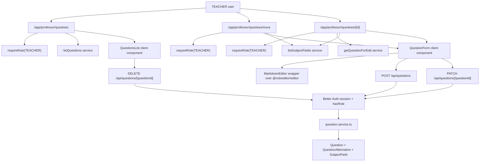

# Questions Design

**Spec**: `.specs/features/questions/spec.md`
**Status**: Draft

---

## Research Notes

- Existing code already uses a modular feature folder, route handlers for mutation boundaries, `requireRole("TEACHER")` for teacher-only pages, Prisma models in English, and shadcn-style local UI.
- `@mdxeditor/editor` is not installed in `package.json` yet.
- MDXEditor official docs say the editor accepts and emits markdown as a string, which matches storing markdown in `Question.descriptionMarkdown`.
- MDXEditor official Next.js App Router docs say it must render client-side only with dynamic import and `ssr: false`; plugin initialization also needs to stay client-side to avoid hydration issues.

Sources used for MDXEditor research:

- https://mdxeditor.dev/editor/docs/overview
- https://mdxeditor.dev/editor/docs/getting-started

---

## Architecture Overview

The feature extends the existing teacher catalog area with three teacher pages: a questions list page, a separate create question page, and a question edit page. All pages are server-protected by role. The list page fetches questions server-side and handles delete interactions; the create page fetches subject fields server-side and renders a blank question form; the edit page fetches subject fields plus the selected question and renders the same form prefilled. API route handlers authorize every mutation, validate inputs with Zod, and call a feature service that owns transactions and domain errors.



---

## Code Reuse Analysis

### Existing Components to Leverage

| Component/Pattern | Location | How to Use |
| --- | --- | --- |
| Teacher role page protection | `src/app/app/professor/grandes-areas/page.tsx` | Reuse `requireRole("TEACHER")` on the questions page. |
| Subject field service | `src/features/subject-fields/subject-field.service.ts` | Reuse `listSubjectFields` for the subject field select options. |
| Form interaction pattern | `src/app/app/professor/grandes-areas/_components/subject-field-form.tsx` | Reuse `react-hook-form`, `zodResolver`, fetch-based JSON handling, alerts, and `router.refresh()`. |
| List/delete pattern | `src/app/app/professor/grandes-areas/_components/subject-fields-list.tsx` | Reuse list cards and delete confirmation ergonomics; edit becomes navigation to a dedicated page. |
| API authorization pattern | `src/app/api/subject-fields/route.ts` | Reuse session lookup and teacher role enforcement. |
| Feature schema/service/test pattern | `src/features/subject-fields/*` | Create parallel `src/features/questions/*` modules. |
| E2E helpers | `src/tests/e2e/helpers/auth.ts`, `src/tests/e2e/helpers/subject-fields.ts` | Reuse login and deterministic test-data cleanup patterns. |

### Integration Points

| System | Integration Method |
| --- | --- |
| Prisma/PostgreSQL | Add `QuestionDifficulty`, `QuestionSource`, `Question`, and `QuestionAlternative`. |
| Subject fields | `Question.subjectFieldId` references `SubjectField.id`; first phase uses `onDelete: Restrict` until cascade plan is implemented. |
| Better Auth roles | Require `TEACHER` for page access and every create/update/delete route. |
| MDXEditor | Add dependency, import CSS globally or in the editor wrapper path, and dynamically load the editor with SSR disabled. |
| App Router | Add `/app/professor/questoes`, `/app/professor/questoes/nova`, `/app/professor/questoes/[id]`, and `/api/questions` route handlers. |
| E2E database | Tests must clean deterministic `Question` rows and their alternatives to avoid state leakage. |

---

## Data Model Recommendation

Recommended model: store alternatives as child rows with an `isCorrect` boolean, `position`, and markdown content. Enforce "at most one correct alternative per question" with a database partial unique index created in the migration, and enforce "at least one correct alternative" plus "minimum two alternatives" in the service transaction.

Why this model:

- It keeps reads simple for future simulados: alternatives travel with the question and the correct row is directly identifiable.
- It avoids a circular required foreign key during create.
- It allows the service to replace/reorder alternatives transactionally on update.
- A partial unique index protects against concurrent writes that accidentally mark two alternatives as correct.

Alternative considered: `Question.correctAlternativeId`. This gives a single pointer to the correct option, but creating a question with alternatives becomes a two-step circular relation. It also needs composite foreign-key care to guarantee the selected alternative belongs to the same question. The boolean-plus-partial-index model is simpler for this codebase.

---

## Components

### Prisma Enums and Models

- **Purpose**: Persist questions and alternatives with English entity/field names.
- **Location**: `prisma/schema.prisma`, `prisma/migrations/*`, `src/generated/prisma/*`
- **Interfaces**:
  - `QuestionDifficulty`: `EASY`, `MEDIUM`, `HARD`
  - `QuestionSource`: `ENADE`, `MANUAL`, `ADAPTED`, `OTHER`
  - `Question`: required subject-field relation and question metadata.
  - `QuestionAlternative`: ordered alternatives with exactly one correct option per question.
- **Dependencies**: Existing `SubjectField` and `User` models.
- **Reuses**: Prisma migration and generated-client pattern.

### Question Schema

- **Purpose**: Validate create/update inputs consistently on client and server.
- **Location**: `src/features/questions/question.schema.ts`, `src/features/questions/question.schema.test.ts`
- **Interfaces**:
  - `questionInputSchema`
  - `questionIdSchema`
  - `questionAlternativeInputSchema`
  - inferred `QuestionInput` type
- **Dependencies**: `zod`, Prisma enum values or literal enum mirrors.
- **Reuses**: Zod style from subject fields and invitations.

### Question Service

- **Purpose**: Own data access, transactions, alternative replacement, subject-field existence checks, and domain errors.
- **Location**: `src/features/questions/question.service.ts`, `src/features/questions/question.service.test.ts`
- **Interfaces**:
  - `listQuestions(): Promise<QuestionListItem[]>`
  - `getQuestionForEdit(questionId): Promise<QuestionEditable>`
  - `createQuestion(input, actorUserId): Promise<QuestionWithAlternatives>`
  - `updateQuestion(questionId, input, actorUserId): Promise<QuestionWithAlternatives>`
  - `deleteQuestion(questionId, actorUserId): Promise<QuestionWithAlternatives>`
- **Dependencies**: Prisma client, schemas, existing SubjectField model.
- **Reuses**: Domain error class pattern from subject fields.

### Question API Routes

- **Purpose**: Provide JSON mutation boundaries for form submissions.
- **Location**:
  - `src/app/api/questions/route.ts`
  - `src/app/api/questions/[questionId]/route.ts`
- **Interfaces**:
  - `POST /api/questions`
  - `PATCH /api/questions/[questionId]`
  - `DELETE /api/questions/[questionId]`
- **Dependencies**: `auth.api.getSession`, `hasRole`, schemas, service.
- **Reuses**: Subject-field route handler response style.

### Markdown Editor Wrapper

- **Purpose**: Isolate MDXEditor client-only behavior and styling from the form.
- **Location**: `src/components/markdown/markdown-editor.tsx` or `src/app/app/professor/questoes/_components/markdown-editor.tsx`
- **Interfaces**:
  - `value: string`
  - `onChange(value: string): void`
  - `ariaLabel?: string`
- **Dependencies**: `@mdxeditor/editor`, dynamic import from `next/dynamic`.
- **Reuses**: shadcn-like borders/labels around the editor, while letting MDXEditor own editing UI.

### Question Form

- **Purpose**: Handle create and edit UI for question fields and alternatives.
- **Location**: `src/app/app/professor/questoes/_components/question-form.tsx`
- **Interfaces**:
  - `subjectFields: SubjectFieldOption[]`
  - `question?: EditableQuestion`
  - `onSaved?: (question) => void`
  - `onCancel?: () => void`
- **Dependencies**: `react-hook-form`, `zodResolver`, markdown editor wrapper, shadcn UI primitives.
- **Reuses**: Subject-field form pattern.

### Alternatives Field Array

- **Purpose**: Let teachers add, remove, edit, reorder, and choose one correct alternative.
- **Location**: route-local component or part of `question-form.tsx` until reuse is needed.
- **Interfaces**:
  - Uses `useFieldArray` from `react-hook-form`.
  - Stores `contentMarkdown`, `isCorrect`, and `position`.
- **Dependencies**: `react-hook-form`, shadcn buttons/inputs, lucide icons.
- **Reuses**: Existing icon button style.
- **Default state**: Create mode starts with 5 empty alternatives; edit mode loads the persisted alternatives.

### Questions List

- **Purpose**: Show existing questions, metadata, alternatives summary, edit controls, and confirmed delete controls.
- **Location**: `src/app/app/professor/questoes/_components/questions-list.tsx`
- **Dependencies**: Question list DTO, question form component.
- **Reuses**: Subject-field list structure.

### Teacher Questions Pages and Navigation

- **Purpose**: Render separate list/create/edit pages, protect access, fetch initial data, and expose navigation.
- **Location**: `src/app/app/professor/questoes/page.tsx`, `src/app/app/professor/questoes/nova/page.tsx`, `src/app/app/professor/questoes/[id]/page.tsx`, `src/app/app/layout.tsx`
- **Dependencies**: `requireRole("TEACHER")`, question service, subject-field service.
- **Reuses**: Existing private layout nav pattern.

---

## Data Models

### Question

```typescript
interface Question {
  id: string
  descriptionMarkdown: string
  difficulty: "EASY" | "MEDIUM" | "HARD"
  source: "ENADE" | "MANUAL" | "ADAPTED" | "OTHER" | null
  year: number | null
  subjectFieldId: string
  correctAnswerExplanation: string | null
  createdById: string
  createdAt: Date
  updatedAt: Date
}
```

**Relationships**:

- `Question.subjectFieldId` references `SubjectField.id`.
- `Question.createdById` references `User.id` for audit.
- `Question.alternatives` has many `QuestionAlternative`.

### QuestionAlternative

```typescript
interface QuestionAlternative {
  id: string
  questionId: string
  contentMarkdown: string
  position: number
  isCorrect: boolean
  createdAt: Date
  updatedAt: Date
}
```

**Relationships and constraints**:

- `questionId` references `Question.id` with `onDelete: Cascade`, so deleting a question deletes its alternatives.
- Unique `questionId, position` keeps ordering stable.
- Partial unique index on `questionId where isCorrect = true` enforces at most one correct alternative per question.
- Service validation enforces at least two alternatives and exactly one correct alternative.

### QuestionInput

```typescript
interface QuestionInput {
  descriptionMarkdown: string
  difficulty: "EASY" | "MEDIUM" | "HARD"
  source?: "ENADE" | "MANUAL" | "ADAPTED" | "OTHER" | null
  year?: number | null
  subjectFieldId: string
  correctAnswerExplanation?: string | null
  alternatives: Array<{
    contentMarkdown: string
    isCorrect: boolean
  }>
}
```

**Validation rules**:

- `descriptionMarkdown`: trim, min 1, max 12000.
- `difficulty`: required enum.
- `source`: optional enum, normalized empty string to `null`.
- `year`: optional integer, recommended range 1996 through current year plus one.
- `subjectFieldId`: required non-empty string, existence checked by service.
- `correctAnswerExplanation`: optional plain text, trim, max 12000, normalized empty string to `null`.
- `alternatives`: min 2, max 8, each content min 1/max 4000, exactly one `isCorrect`.
- Create-form default: 5 alternatives.

---

## Error Handling Strategy

| Error Scenario | Handling | User Impact |
| --- | --- | --- |
| Invalid question input | Zod validation in client and route handler | Field/form feedback asks for correction. |
| Missing subject field | Service throws `QUESTION_SUBJECT_FIELD_NOT_FOUND` | Form asks user to choose another grande area or create one. |
| Missing question on edit/delete | Service throws `QUESTION_NOT_FOUND` | UI shows failure and remains reloadable. |
| Invalid correct alternative count | Schema/service throws validation error | Form highlights alternatives section. |
| Unauthorized user | Page redirects via `requireRole`; API returns `401` | Student/admin cannot access or mutate. |
| Transaction failure while replacing alternatives | Roll back question and alternatives | Existing question remains unchanged. |
| Concurrent duplicate correct alternatives | Partial unique index plus service mapping | User sees a generic save failure; data remains consistent. |

---

## Tech Decisions

| Decision | Choice | Rationale |
| --- | --- | --- |
| Question wording storage | `descriptionMarkdown` string | Matches the required markdown editor and keeps markdown as canonical content. |
| Alternative wording storage | `contentMarkdown` string | Keeps future support for formulas, lists, and emphasis in alternatives. |
| Correct answer explanation | Plain nullable text in `correctAnswerExplanation` | The requirement asks for an optional text field; it does not need the markdown editor in the first implementation. |
| Correct alternative model | `QuestionAlternative.isCorrect` plus partial unique index | Simpler create/update flow and strong enough DB guard for at most one correct answer. |
| Alternative update strategy | Replace alternatives transactionally on question update | Simpler than diffing nested rows and guarantees submitted order matches persisted order. |
| Source | Nullable enum `QuestionSource` | Satisfies optional source while preserving controlled values. |
| Year | Nullable integer | Satisfies optional numeric year and supports filtering later. |
| Created-by audit | `Question.createdById` with `onDelete: Restrict` | Mirrors `SubjectField.createdById` audit pattern. |
| Subject-field delete behavior | Keep restrict in this feature | User requested cascade as a later plan; avoid mixing phases. |
| Markdown editor loading | Client-only wrapper with dynamic import and `ssr: false` | Required by official MDXEditor Next.js App Router docs. |
| Route naming | English API `/api/questions`, Portuguese pages `/app/professor/questoes`, `/app/professor/questoes/nova`, and `/app/professor/questoes/[id]` | Matches existing code/API split used for grandes areas while separating list, create, and edit screens. |

---

## Notes for Implementation

- Before editing Next.js route/page code, read the relevant Next.js 16 docs under `node_modules/next/dist/docs/`.
- Add `@mdxeditor/editor` with the package manager before implementing the editor wrapper.
- Prefer a route-local markdown wrapper first; move it to `src/components/markdown` only if reuse is clearly useful.
- The partial unique index for one correct alternative likely needs raw SQL in the Prisma migration.
- Route handlers should not rely on page access; they must authorize internally.
- E2E must seed or create a deterministic subject field before creating questions.
