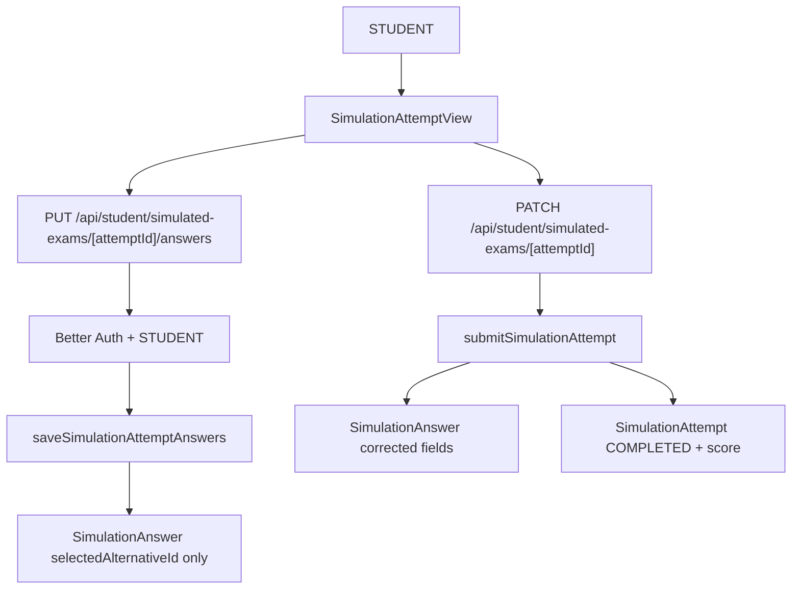

# Simulation Answer Drafts Design

**Spec**: `.specs/features/simulation-answer-drafts/spec.md`
**Status**: Draft

---

## Architecture Overview

The feature extends the existing student simulated-exam flow instead of creating a separate draft system. In-progress answers are stored in the existing `SimulationAnswer` row per attempt question, but correction fields become nullable until final submission. A new save service and API route persist selected alternatives without reading or returning correct-answer data. The existing finalization path is updated to correct the persisted answer set and mark the attempt complete.



> `mermaid-studio` is not installed in this environment, so this document uses inline Mermaid.

---

## Code Reuse Analysis

### Existing Components to Leverage

| Component/Pattern | Location | How to Use |
| --- | --- | --- |
| Simulation service/domain errors | `src/features/simulated-exams/simulated-exam.service.ts` | Add a save function beside `submitSimulationAttempt`, reusing ownership/status/error patterns. |
| Simulation schemas | `src/features/simulated-exams/simulated-exam.schema.ts` | Reuse answer payload shape and duplicate-answer validation for both save and submit, or extract a shared answer-list schema. |
| In-progress DTO | `src/features/simulated-exams/simulated-exam.service.ts` | Keep the safe projection that returns only `selectedAlternativeId` for saved answers. |
| Existing attempt API | `src/app/api/student/simulated-exams/[attemptId]/route.ts` | Keep finalization on `PATCH`; add a sibling answers route for draft saves. |
| Attempt UI | `src/app/app/student/simulados/_components/simulation-attempt-view.tsx` | Add save button/state while preserving finalization behavior. |
| E2E helpers | `src/tests/e2e/helpers/simulated-exams.ts` | Reuse deterministic question setup and cleanup. |

### Integration Points

| System | Integration Method |
| --- | --- |
| Prisma/PostgreSQL | Migration makes `SimulationAnswer.correctAlternativeId` and `SimulationAnswer.isCorrect` nullable. |
| Better Auth roles | New save API requires `STUDENT`, same as existing simulated-exam APIs. |
| App Router API routes | Add route handler under `/api/student/simulated-exams/[attemptId]/answers`. |
| Student UI | Add explicit save action and persisted/dirty/error states in the existing Client Component. |
| E2E DB | Existing cleanup covers `SimulationAnswer`; tests must avoid leaking deterministic attempts. |

---

## Data Models

### SimulationAnswer

```typescript
interface SimulationAnswer {
  id: string
  attemptQuestionId: string
  selectedAlternativeId: string | null
  correctAlternativeId: string | null
  isCorrect: boolean | null
  answeredAt: Date
}
```

**Draft state**:

- `selectedAlternativeId`: selected alternative.
- `correctAlternativeId`: `null`.
- `isCorrect`: `null`.
- Attempt remains `IN_PROGRESS`.

**Completed state**:

- `selectedAlternativeId`: selected alternative, when answered.
- `correctAlternativeId`: correct alternative snapshot.
- `isCorrect`: correction result.
- Attempt is `COMPLETED`.

### Prisma Constraint Notes

| Field/Constraint | Change |
| --- | --- |
| `SimulationAnswer.correctAlternativeId` | Change from required `String` to nullable `String?`. |
| `SimulationAnswer.correctAlternative` relation | Change to nullable relation. |
| `SimulationAnswer.isCorrect` | Change from required `Boolean` to nullable `Boolean?`. |
| `SimulationAnswer.attemptQuestionId` | Keep unique; still one answer row per attempt question. |
| `SimulationAnswer.selectedAlternativeId` | Keep nullable to support future explicit clearing, though MVP save payload only sends selected answers. |

This design intentionally does not introduce a new `SimulationDraftAnswer` table. The existing `SimulationAnswer` cardinality already matches the domain, and nullable correction fields encode the lifecycle directly without duplicating answer storage.

---

## Components

### Simulation Schemas

- **Purpose**: Validate answer-list payloads for both draft save and final submit.
- **Location**: `src/features/simulated-exams/simulated-exam.schema.ts`
- **Interfaces**:
  - `simulationAnswerListInputSchema` or equivalent shared internal schema.
  - `simulationSaveAnswersInputSchema`.
  - `simulationSubmitInputSchema`.
- **Rules**:
  - `answers` max remains aligned to `maxQuestionsPerSimulation`.
  - Each answer has `attemptQuestionId` and `selectedAlternativeId`.
  - Duplicate `attemptQuestionId` values are rejected.

### Simulated Exam Service

- **Purpose**: Persist drafts and finalize/correct attempts.
- **Location**: `src/features/simulated-exams/simulated-exam.service.ts`
- **Interfaces**:
  - `saveSimulationAttemptAnswers(attemptId, input, studentId): Promise<SimulationAttemptInProgressDetail>`
  - existing `submitSimulationAttempt(attemptId, input, studentId): Promise<SimulationAttemptReviewDetail>`
- **Save behavior**:
  - Parse input.
  - Find attempt by `id` and `studentId`.
  - Reject `COMPLETED`.
  - Validate every `attemptQuestionId` belongs to the attempt.
  - Validate each `selectedAlternativeId` belongs to that question.
  - Upsert rows with selected alternative only, keeping `correctAlternativeId: null` and `isCorrect: null`.
  - Update `answeredCount` to the persisted answer count for the attempt.
  - Return safe in-progress detail through `getInProgressSimulationAttemptForStudent`.
- **Submit behavior update**:
  - Merge persisted answers with payload answers, with payload values winning for duplicated questions.
  - Correct the merged answer set.
  - Upsert corrected rows with `correctAlternativeId`, `isCorrect`, and fresh `answeredAt`.
  - Finalize attempt aggregates.

### Draft Save API Route

- **Purpose**: Thin authenticated mutation boundary for partial saves.
- **Location**: `src/app/api/student/simulated-exams/[attemptId]/answers/route.ts`
- **Interface**:
  - `PUT /api/student/simulated-exams/[attemptId]/answers`
- **Rules**:
  - Require `STUDENT`.
  - Validate `attemptId` and JSON body.
  - Return `{ success: true, attempt }` with safe in-progress DTO.
  - Map `SIMULATION_ATTEMPT_NOT_FOUND` to `404`, `SIMULATION_INVALID_ANSWER` to `400`, and `SIMULATION_ATTEMPT_ALREADY_COMPLETED` to `409`.

### Existing Submit API Route

- **Purpose**: Continue to represent finalization/correction.
- **Location**: `src/app/api/student/simulated-exams/[attemptId]/route.ts`
- **Change**:
  - Keep `PATCH` as finalization.
  - Use updated submit service that considers persisted answers.
  - Continue returning completed review detail only after finalization.

### Attempt UI

- **Purpose**: Let students save draft answers and see saved/dirty/error state.
- **Location**: `src/app/app/student/simulados/_components/simulation-attempt-view.tsx`
- **Behavior**:
  - Maintain local `selectedByQuestion` state as today.
  - Track `lastSavedByQuestion` or a dirty flag derived from the saved baseline.
  - Add a secondary "Salvar respostas" action for `mode === "in-progress"`.
  - Disable save while the save request is pending.
  - Show concise success/error feedback using existing `Alert`/text patterns.
  - Keep "Finalizar e corrigir" as the only action that triggers correction.

---

## Error Handling Strategy

| Error Scenario | Handling | User Impact |
| --- | --- | --- |
| Attempt not found/not owned | Service throws `SIMULATION_ATTEMPT_NOT_FOUND`; route returns `404` | Generic failure; no ownership leakage. |
| Attempt already completed | Service throws `SIMULATION_ATTEMPT_ALREADY_COMPLETED`; route returns `409` | UI says the simulado ja foi finalizado. |
| Invalid attempt question or alternative | Service throws `SIMULATION_INVALID_ANSWER`; route returns `400` | UI says uma alternativa selecionada nao pertence a questao. |
| Unauthorized role | Route returns `401` before parsing/mutation | Non-students cannot save answers. |
| Network/server save failure | UI keeps local selections and shows retryable error | Student does not lose current browser state. |
| Correct-answer leakage during draft | Unit/E2E assertions fail if fields appear | Release blocked before exposing answers. |

---

## Tech Decisions

| Decision | Choice | Rationale |
| --- | --- | --- |
| Draft storage | Reuse `SimulationAnswer` with nullable correction fields | Avoids duplicate tables and matches one-answer-per-question cardinality. |
| Save route | Add `/answers` sub-route with `PUT` | Separates "save draft" from finalization `PATCH`, making intent explicit. |
| Save UX | Explicit save button first | Lower complexity and easier E2E than autosave; autosave can be layered later. |
| Answer count | Update `answeredCount` on save | Keeps history progress accurate for in-progress attempts. |
| Submit merge | Payload answers override persisted answers | Lets final click use the freshest UI state even if student has unsaved changes. |
| Correct-answer secrecy | Save path must not select `isCorrect` from alternatives | Draft save only validates alternative membership; correction fields are read only during finalization. |

---

## Open Implementation Notes

- Before editing App Router route handlers/pages, read the relevant Next.js 16 docs under `node_modules/next/dist/docs/` per `AGENTS.md`.
- The implementation should update `.notebook/student-simulated-exams.md` after verification because this changes the persistence lifecycle of `SimulationAnswer`.
