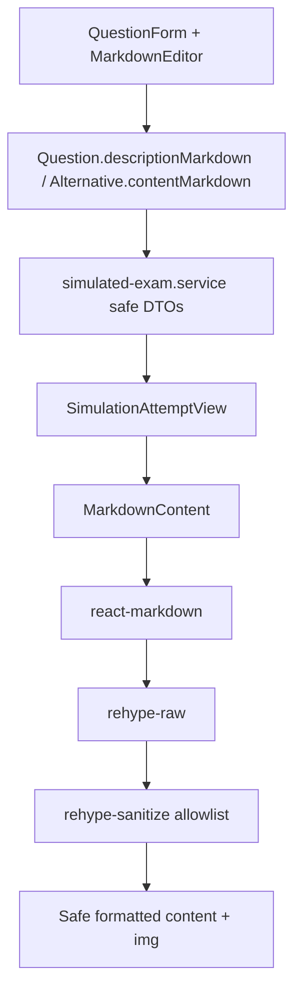

# Student Markdown Rendering Design

**Spec**: `.specs/features/student-markdown-rendering/spec.md`
**Status**: Draft

---

## Research Notes

- `src/app/app/aluno/simulados/_components/simulation-attempt-view.tsx` hoje imprime `descriptionMarkdown` e `contentMarkdown` como texto puro.
- `src/components/markdown/markdown-editor.tsx` usa `@mdxeditor/editor` para autoria, mas a propria documentacao do MDXEditor recomenda renderizar conteudo de leitura com uma biblioteca Markdown, nao com o editor em modo read-only.
- `react-markdown` renderiza Markdown para React e e seguro por padrao, mas nao interpreta HTML cru sem `rehype-raw`.
- Como o formato atual de imagem pode ser ``, a renderizacao precisa de `rehype-raw` junto de `rehype-sanitize` com allowlist restrita.
- A documentacao do Next.js descreve MDX como superset com JSX/componentes; esse poder nao e necessario para imagens e aumentaria risco para conteudo vindo do banco.

Sources used:

- `src/app/app/aluno/simulados/_components/simulation-attempt-view.tsx`
- `src/components/markdown/markdown-editor.tsx`
- `package.json`
- https://github.com/remarkjs/react-markdown
- https://github.com/rehypejs/rehype-sanitize
- https://mdxeditor.dev/editor/docs/overview
- https://nextjs.org/docs/app/guides/mdx

---

## Architecture Overview

Criar um componente compartilhado `MarkdownContent` para renderizacao segura de leitura. A tela do aluno continua sendo Client Component para selecao/salvamento das respostas, mas delega parsing/sanitizacao ao componente compartilhado. O componente usa Markdown + HTML raw sanitizado, com componentes customizados para `img` e `a`.



> `mermaid-studio` is not installed in this session, so this document uses inline Mermaid.

---

## Code Reuse Analysis

### Existing Components to Leverage

| Component/Pattern | Location | How to Use |
| --- | --- | --- |
| Markdown folder | `src/components/markdown` | Add read-only renderer beside the existing editor wrapper. |
| Student attempt view | `src/app/app/aluno/simulados/_components/simulation-attempt-view.tsx` | Replace plain text nodes with `MarkdownContent`. |
| `cn` helper | `src/lib/utils.ts` | Merge renderer classes and caller-provided classes. |
| E2E student flow | `src/tests/e2e/student-simulated-exams.spec.ts` | Extend or add focused coverage for formatted Markdown/images. |
| E2E question helpers | `src/tests/e2e/helpers/questions.ts` | Seed/create question content with Markdown/HTML image. |

### Integration Points

| System | Integration Method |
| --- | --- |
| Markdown rendering dependencies | Add `react-markdown`, `remark-gfm`, `rehype-raw`, `rehype-sanitize` if not already installed. |
| Student answer UI | Keep radio input and label behavior; only inner content rendering changes. |
| DTO/security boundary | No service fields change; in-progress DTOs still exclude correction data. |
| Tailwind/shadcn styling | Use restrained prose-like classes without introducing a parallel design system. |

---

## Components

### MarkdownContent

- **Purpose**: Render trusted-in-origin but still sanitized Markdown/HTML strings for read-only app content.
- **Location**: `src/components/markdown/markdown-content.tsx`
- **Interfaces**:
  - `type MarkdownContentProps = { value: string | null | undefined; className?: string; compact?: boolean }`
- **Dependencies**: `react-markdown`, `remark-gfm`, `rehype-raw`, `rehype-sanitize`, `cn`.
- **Reuses**: Existing markdown component folder and Tailwind utility style.
- **Behavior**:
  - Return `null` for empty values.
  - Enable GFM for tables/lists if dependency is added.
  - Parse raw HTML only before sanitization.
  - Render `img` with responsive classes and safe attributes.
  - Render `a` with safe `rel` when external/new-tab behavior is configured.

### Markdown Sanitization Schema

- **Purpose**: Keep allowed HTML elements/attributes explicit and testable.
- **Location**: Either inside `markdown-content.tsx` if small, or `src/components/markdown/markdown-sanitize.ts`.
- **Interfaces**:
  - `markdownSanitizeSchema`
  - Optional `isAllowedMarkdownUrl(url: string): boolean`
- **Allowed shape**:
  - Text formatting: `p`, `strong`, `em`, `s`, `blockquote`, `br`, `hr`.
  - Lists: `ul`, `ol`, `li`.
  - Code: `code`, `pre`.
  - Links: `a[href,title]` with URL protocol restriction.
  - Images: `img[src,alt,title,width,height]` with URL protocol restriction.
  - Tables only if GFM support is desired: `table`, `thead`, `tbody`, `tr`, `th`, `td`.
- **Blocked shape**:
  - `script`, `style`, `iframe`, `object`, `embed`, `form`, event handler attributes, `javascript:` URLs, SVG tags.

### SimulationAttemptView Integration

- **Purpose**: Use `MarkdownContent` for question statement and alternatives without changing answer logic.
- **Location**: `src/app/app/aluno/simulados/_components/simulation-attempt-view.tsx`
- **Interfaces**:
  - Replace paragraph rendering of `activeQuestion.question.descriptionMarkdown`.
  - Replace text span rendering of `alternative.contentMarkdown`.
- **Dependencies**: `MarkdownContent`.
- **Reuses**: Current active question, radio selection, save/finalize logic.

---

## Data Models

No Prisma change. Existing fields remain:

```typescript
interface QuestionMarkdownFields {
  descriptionMarkdown: string
  alternatives: Array<{ contentMarkdown: string }>
  correctAnswerExplanation?: string | null
}
```

The persisted HTML image tag remains supported as content data, not executable code.

---

## Error Handling Strategy

| Error Scenario | Handling | User Impact |
| --- | --- | --- |
| Invalid Markdown syntax | Renderer outputs best-effort content or nothing for broken nodes. | Simulado remains usable. |
| Dangerous HTML | Sanitizer strips disallowed tags/attributes. | Unsafe content is not rendered. |
| Unsafe image/link URL | URL is removed or element is not rendered. | Image/link may not appear, but layout stays intact. |
| Missing dependency/types | Build fails during implementation. | Caught before merge. |

---

## Tech Decisions

| Decision | Choice | Rationale |
| --- | --- | --- |
| Renderer | `react-markdown` | React-native renderer, safe by default, customizable components. |
| HTML support | `rehype-raw` followed by `rehype-sanitize` | Required for stored `` tags while preserving sanitization. |
| MDX support | Do not enable MDX execution | Images do not require JSX/components; content comes from DB. |
| Component location | `src/components/markdown/markdown-content.tsx` | Keeps render policy centralized next to the editor wrapper. |
| First integration surface | Student attempt view | Directly solves the study experience requested. |

---

## Security Notes

- Sanitization must run after raw HTML parsing.
- Do not use `dangerouslySetInnerHTML`.
- Do not allow event handler attributes.
- Do not allow `javascript:` or `data:` URLs for links.
- Allow `data:` images only if product explicitly needs pasted inline images later; default plan is to reject them and rely on uploaded/persistent URLs.
