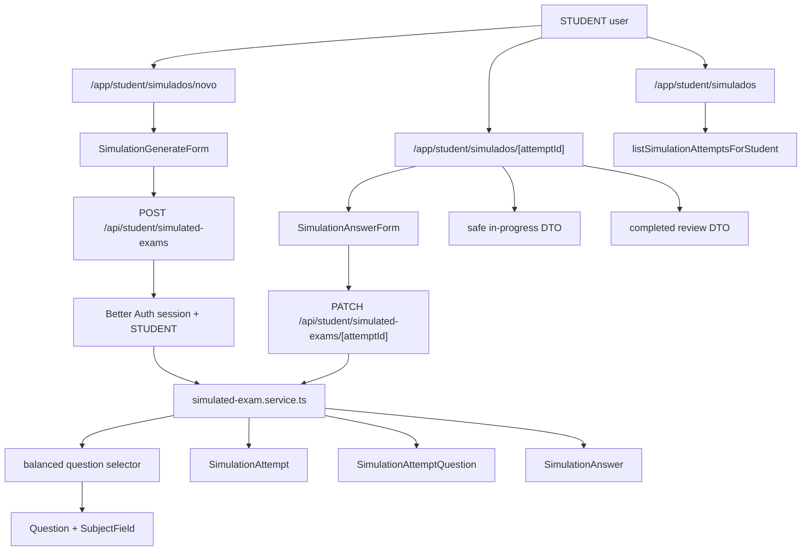

# Student Simulated Exams Design

**Spec**: `.specs/features/student-simulated-exams/spec.md`
**Status**: Draft

---

## Architecture Overview

The feature adds a student-only simulation area under `/app/student/simulados`. Server pages authorize with `requireRole("STUDENT")`; route handlers authorize again before mutations. A `simulated-exams` feature service owns question selection, attempt creation, answer upsert, final scoring, and history reads. The database stores attempts, selected questions, selected subject fields, and answers as normalized rows.



> `mermaid-studio` was not installed in this environment, so this document uses inline Mermaid.

---

## Code Reuse Analysis

### Existing Components to Leverage

| Component/Pattern | Location | How to Use |
| --- | --- | --- |
| Student role protection | `src/app/app/student/page.tsx` | Reuse `requireRole("STUDENT")` on all student simulated-exam pages. |
| Private app navigation | `src/app/app/layout.tsx` | Add student-only links for generating and viewing simulados. |
| Subject fields listing service | `src/features/subject-fields/subject-field.service.ts` | Either extend with a question-count filter or create a simulation-specific read that lists eligible grandes areas. |
| Question model with alternatives | `prisma/schema.prisma`, `src/features/questions/question.service.ts` | Reuse `Question`, `QuestionAlternative`, `QuestionDifficulty`, and correct-answer flag. |
| Form stack | Existing route `_components` forms | Use `react-hook-form`, `zodResolver`, zod schemas, shadcn primitives, and fetch JSON pattern. |
| Domain service pattern | `src/features/questions/question.service.ts` | Create `SimulationDomainError`, typed DTOs, schema parsing, Prisma error mapping as needed. |
| E2E helpers | `src/tests/e2e/helpers/auth.ts`, `src/tests/e2e/helpers/questions.ts`, `src/tests/e2e/helpers/subject-fields.ts` | Seed deterministic questions/grandes areas and login as student. |

### Integration Points

| System | Integration Method |
| --- | --- |
| Prisma/PostgreSQL | Add attempt, attempt subject field, attempt question, and answer models. |
| Better Auth roles | Pages and APIs require `STUDENT`; all reads/writes include `studentId`. |
| Question catalog | Attempts reference existing questions and alternatives. |
| App Router | Add student pages and API route handlers under student route namespaces. |
| E2E DB | Add deterministic cleanup for simulation rows because the test DB is not reset between runs. |

---

## Data Model Recommendation

Use normalized attempt tables with one row per selected question and one optional answer row per selected question. This does not overload PostgreSQL for the expected domain; it gives correct indexing, precise history, and future ranking data. The alternative would be storing answers as JSON on the attempt, but that weakens constraints, ownership checks, question-level review, and reporting.

### Why one row per answer is acceptable

- It is the natural cardinality of the domain: one student answer belongs to one attempt question.
- Indexes on `attemptId`, `studentId`, and uniqueness constraints keep reads predictable.
- Future ranking, analytics by difficulty, and “questions most missed” become feasible without JSON extraction.
- Storage stays small because answers reference alternatives instead of duplicating markdown.

---

## Data Models

### SimulationAttemptStatus

```typescript
type SimulationAttemptStatus = "IN_PROGRESS" | "COMPLETED"
```

### SimulationAttempt

```typescript
interface SimulationAttempt {
  id: string
  studentId: string
  status: "IN_PROGRESS" | "COMPLETED"
  requestedQuestionCount: number
  totalQuestions: number
  answeredCount: number
  correctCount: number
  wrongCount: number
  scorePercent: number
  completedAt: Date | null
  createdAt: Date
  updatedAt: Date
}
```

**Relationships**:

- `studentId` references `User.id` with `onDelete: Cascade`.
- Has many `SimulationAttemptQuestion`.
- Has many selected `SimulationAttemptSubjectField`.

### SimulationAttemptSubjectField

```typescript
interface SimulationAttemptSubjectField {
  attemptId: string
  subjectFieldId: string
}
```

**Purpose**: Preserve the generation filter for history and future analytics.

### SimulationAttemptQuestion

```typescript
interface SimulationAttemptQuestion {
  id: string
  attemptId: string
  questionId: string
  position: number
  difficulty: "EASY" | "MEDIUM" | "HARD"
  subjectFieldId: string
}
```

**Purpose**: Freeze the selected question set and stable display order for this attempt. `position` is for rendering, review, and progress navigation only; it must not force the student to answer in sequence. `difficulty` and `subjectFieldId` are copied from `Question` to preserve generation/reporting metadata even if the question is edited later.

### SimulationAnswer

```typescript
interface SimulationAnswer {
  id: string
  attemptQuestionId: string
  selectedAlternativeId: string | null
  correctAlternativeId: string
  isCorrect: boolean
  answeredAt: Date
}
```

**Purpose**: Store correction result per question. `correctAlternativeId` snapshots the correct alternative at correction time, which protects review if a teacher later edits which alternative is correct.

### Prisma Constraint Plan

| Model | Constraint/Index |
| --- | --- |
| `SimulationAttempt` | index `[studentId, createdAt]`, index `[status, updatedAt]` |
| `SimulationAttemptSubjectField` | composite id/unique `[attemptId, subjectFieldId]`, index `[subjectFieldId]` |
| `SimulationAttemptQuestion` | unique `[attemptId, questionId]`, unique `[attemptId, position]`, index `[questionId]` |
| `SimulationAnswer` | unique `[attemptQuestionId]`, index `[selectedAlternativeId]`, index `[correctAlternativeId]` |

Deletion rules: deleting a student cascades attempts; deleting an attempt cascades attempt questions/answers/filter rows. Deleting a catalog question should be restricted while attempts reference it, unless a later soft-delete/archive strategy is introduced.

---

## Components

### Simulation Schemas

- **Purpose**: Validate generation and answer payloads.
- **Location**: `src/features/simulated-exams/simulated-exam.schema.ts`
- **Interfaces**:
  - `simulationGenerationInputSchema`
  - `simulationSubmitInputSchema`
  - `simulationAttemptIdSchema`
- **Rules**:
  - `subjectFieldIds`: 1..20 unique ids.
  - `questionCount`: integer 1..100.
  - answers: one selected alternative per answered attempt-question.

### Balanced Question Selector

- **Purpose**: Choose `N` questions from selected grandes areas, balancing difficulties.
- **Location**: `src/features/simulated-exams/question-selection.ts`
- **Interface**:
  - `selectBalancedQuestions(input, tx?): Promise<SelectedQuestion[]>`
- **Algorithm**:
  1. Count eligible questions grouped by difficulty.
  2. Compute target quotas as evenly as possible across `EASY`, `MEDIUM`, `HARD`.
  3. Cap each quota by available count.
  4. Redistribute shortage to remaining difficulties with availability.
  5. Randomly select question ids per difficulty.
  6. Shuffle final set and assign stable positions.
- **Implementation note**: prefer PostgreSQL random ordering for first version because selected volumes are limited; revisit if catalog grows substantially.

### Simulated Exam Service

- **Purpose**: Own attempt creation, ownership checks, answer correction, final scoring, and history reads.
- **Location**: `src/features/simulated-exams/simulated-exam.service.ts`
- **Interfaces**:
  - `listEligibleSubjectFields(): Promise<SubjectFieldOption[]>`
  - `createSimulationAttempt(input, studentId): Promise<SimulationAttemptCreated>`
  - `getInProgressSimulationAttemptForStudent(attemptId, studentId): Promise<SimulationAttemptInProgressDetail>`
  - `getCompletedSimulationAttemptForStudent(attemptId, studentId): Promise<SimulationAttemptReviewDetail>`
  - `submitSimulationAttempt(attemptId, input, studentId): Promise<SimulationAttemptDetail>`
  - `listSimulationAttemptsForStudent(studentId): Promise<SimulationAttemptSummary[]>`
- **Dependencies**: Prisma, schemas, question selector.
- **Reuses**: Domain error style from question/subject-field services.
- **Security boundary**: in-progress DTOs must select/project alternatives without `isCorrect`, must not include `correctAlternativeId`, and must not include `correctAnswerExplanation`. Correct-answer fields are allowed only in completed review DTOs after finalization.

### Attempt DTOs

- **Purpose**: Keep the answer-taking payload separate from the review payload so the network cannot reveal correct answers during an active attempt.
- **Location**: `src/features/simulated-exams/simulated-exam.service.ts` or route-local DTO mapper module.
- **Interfaces**:
  - `SimulationAttemptInProgressDetail`: includes attempt metadata, selected questions, public question text, alternatives `{ id, contentMarkdown, position }`, current selected answer if saved, and progress counts. It excludes `isCorrect`, `correctAlternativeId`, `correctAnswerExplanation`, and any derived correct-answer flag.
  - `SimulationAttemptReviewDetail`: available only for `COMPLETED` attempts; includes chosen alternative, correct alternative, per-question `isCorrect`, and score summary.
- **Rule**: Never pass raw Prisma `Question` or `QuestionAlternative` records directly to Client Components or JSON responses for in-progress attempts; always map through the safe DTO.

### Student Pages

- **Purpose**: Provide student UI for history, generation, answering, and review.
- **Location**:
  - `src/app/app/student/simulados/page.tsx`
  - `src/app/app/student/simulados/novo/page.tsx`
  - `src/app/app/student/simulados/[attemptId]/page.tsx`
- **Dependencies**: `requireRole("STUDENT")`, service reads, route-local client components.
- **Reuses**: shadcn UI primitives and existing private layout.

### Generation Form

- **Purpose**: Let students select grandes areas and question count.
- **Location**: `src/app/app/student/simulados/_components/simulation-generate-form.tsx`
- **Dependencies**: `react-hook-form`, `zodResolver`, checkbox/toggle controls, numeric input.
- **Behavior**: POSTs to create API, then navigates to the attempt page.

### Answer/Review Component

- **Purpose**: Render navigable questions with alternatives for in-progress attempts and corrected review for completed attempts.
- **Location**: `src/app/app/student/simulados/_components/simulation-attempt-view.tsx`
- **Dependencies**: DTO from service, shadcn radio controls/buttons/badges.
- **Behavior**: In progress, shows one active question at a time plus previous/next controls and a question navigator/status list. Students can jump to any question, answer in any order, and finish when ready. Completed, disables inputs and highlights chosen/correct alternatives.

### API Routes

- **Purpose**: Thin authenticated mutation boundaries.
- **Location**:
  - `src/app/api/student/simulated-exams/route.ts`
  - `src/app/api/student/simulated-exams/[attemptId]/route.ts`
- **Interfaces**:
  - `POST /api/student/simulated-exams`
  - `PATCH /api/student/simulated-exams/[attemptId]`
- **Rules**: Require `STUDENT`, parse JSON defensively, map domain errors to stable response codes.

---

## Error Handling Strategy

| Error Scenario | Handling | User Impact |
| --- | --- | --- |
| No selected subject fields | Zod client/server validation | Form error asks student to select at least one grande area. |
| Invalid question count | Zod client/server validation | Form error shows allowed range. |
| Not enough questions | Service throws `SIMULATION_NOT_ENOUGH_QUESTIONS` with available count | Form displays how many questions are available. |
| Attempt not found or not owned | Service throws `SIMULATION_ATTEMPT_NOT_FOUND` | 404/not found or redirect-safe error. |
| Attempt completed | Service throws `SIMULATION_ATTEMPT_ALREADY_COMPLETED` | UI says the simulado cannot be changed. |
| Alternative does not belong to attempt question | Service throws `SIMULATION_INVALID_ANSWER` | Submission rejected with generic correction error. |
| In-progress payload accidentally includes correct-answer fields | Unit tests and E2E network assertions fail | Release is blocked before students can inspect answers. |
| Unauthorized role | Page redirects; API returns `401` | Non-students cannot use the flow. |

---

## Tech Decisions

| Decision | Choice | Rationale |
| --- | --- | --- |
| Persist answers as rows | `SimulationAnswer` per attempt question | Best fit for history, constraints, and ranking/analytics future. |
| Preserve selected set | `SimulationAttemptQuestion` rows | Prevents regenerated/random question drift when reviewing. |
| Preserve selected filter | `SimulationAttemptSubjectField` rows | Makes history explainable and future metrics easier. |
| Score storage | Store aggregate counts and `scorePercent` on attempt | Supports future ranking without querying every answer for list pages. |
| Snapshot scope | Copy `difficulty`, `subjectFieldId`, and `correctAlternativeId`; reference question markdown | Balances auditability and storage. |
| Correct-answer secrecy | Use separate in-progress and completed-review DTOs | Prevents students from inspecting network/HTML payloads to discover correct answers before submission. |
| Question deletion | Restrict deletion while referenced by attempts | Protects historical review; soft delete can be planned later. |
| First selector | Balanced by difficulty, random within each difficulty | Matches current requirement without overengineering adaptive behavior. |

---

## Notes for Implementation

- Before editing Next.js pages/routes, read the relevant Next.js 16 docs in `node_modules/next/dist/docs/` as required by `AGENTS.md`.
- The existing P1 concern about E2E data leakage applies strongly here; simulation E2E setup must clean attempts/answers it creates.
- Because `SubjectField -> Question` currently cascades, deleting a grande area can delete catalog questions. Attempts referencing deleted questions require either restricting deletes once attempts exist or introducing question archival before production use. This design chooses restrict for `Question -> SimulationAttemptQuestion` and flags cascade behavior as a product risk to resolve during implementation planning.
- If immutable historical wording is required later, add snapshot columns for `descriptionMarkdown` and alternatives to `SimulationAttemptQuestion`/answer snapshot tables.
