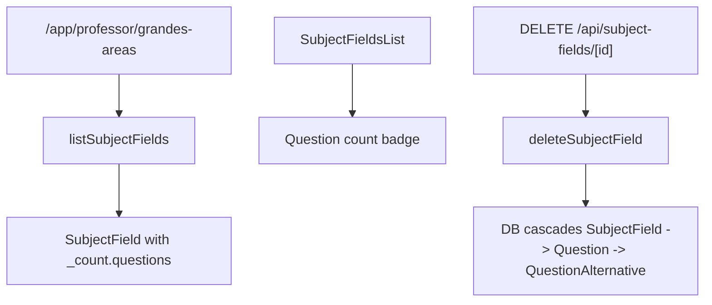

# Subject Field Question Rollup Design

**Spec**: `.specs/features/subject-field-question-rollup/spec.md`
**Status**: Implemented

---

## Architecture Overview

This follow-up feature modifies the existing subject-field list/read/delete flow after the question model exists. The subject-field service will include `_count.questions`, the UI will render that count, and the Prisma relation from `Question` to `SubjectField` will move to cascade deletion.

---

## Components

### SubjectField Service Count

- **Purpose**: Include the number of related questions in subject-field list items.
- **Location**: `src/features/subject-fields/subject-field.service.ts`
- **Reuses**: Existing `listSubjectFields` query.

### SubjectField List UI Count

- **Purpose**: Display question count in each grande area card.
- **Location**: `src/app/app/professor/grandes-areas/_components/subject-fields-list.tsx`
- **Reuses**: Existing `Badge` component.

### Cascade Schema Change

- **Purpose**: Delete questions when their subject field is deleted.
- **Location**: `prisma/schema.prisma`, migration.
- **Reuses**: `QuestionAlternative.questionId onDelete: Cascade` from the questions feature.

---

## Tech Decisions

| Decision | Choice | Rationale |
| --- | --- | --- |
| Count source | Prisma relation count | Avoids denormalized counters and stays accurate. |
| Cascade location | Database relation from `Question.subjectFieldId` to `SubjectField.id` | Guarantees cleanup even if deletion happens outside UI. |
| Alternatives cascade | Keep `QuestionAlternative.questionId onDelete: Cascade` | Already belongs naturally to question lifecycle. |

---

## Notes for Implementation

- Implement only after `.specs/features/questions` has shipped.
- Update E2E cleanup carefully because deleting subject fields may delete questions created by tests.
