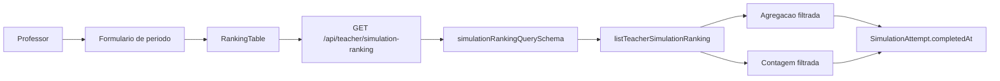

# Teacher Simulation Ranking Date Filter Design

**Spec**: `.specs/features/teacher-simulation-ranking-date-filter/spec.md`
**Status**: Draft

---

## Architecture Overview

O formulario envia datas civis opcionais (`YYYY-MM-DD`) na query. O schema confiavel valida formato e ordem; o service constroi uma unica clausula SQL para `SimulationAttempt.completedAt` e a usa tanto na agregacao quanto na contagem. Assim, linhas e paginação nunca divergem.



## Code Reuse Analysis

| Component/Pattern | Location | How to Use |
| --- | --- | --- |
| Query schema | `src/features/simulation-ranking/simulation-ranking.schema.ts` | Adicionar limites e validacao cruzada. |
| Ranking service | `src/features/simulation-ranking/simulation-ranking.service.ts` | Centralizar fragmento SQL reutilizado por agregacao e count. |
| Ranking table | `src/app/app/professor/ranking/_components/ranking-table.tsx` | Inserir formulario e incluir datas em toda `URLSearchParams`. |
| shadcn primitives | `src/components/ui/{input,field,button,alert}.tsx` | Formulario consistente e acessivel. |
| Existing form pattern | `src/app/app/professor/grandes-areas/_components/subject-field-form.tsx` | Usar `react-hook-form`, `zodResolver` e Zod. |
| Ranking E2E helper | `src/tests/e2e/helpers/simulation-ranking.ts` | Aceitar `completedAt` deterministico. |

## Components

### Query schema

- **Location**: `src/features/simulation-ranking/simulation-ranking.schema.ts`
- **Contract**: `startDate?: string` e `endDate?: string`, ambos ISO civil; strings vazias sao normalizadas para `undefined`, e inicio nao pode ser posterior ao fim.
- **Reuse**: Zod 4.4.3 possui `z.iso.date()` e os defaults atuais de paginacao/ordem permanecem intactos.

### Ranking service

- **Location**: `src/features/simulation-ranking/simulation-ranking.service.ts`
- **Contract**: `listTeacherSimulationRanking` preserva assinatura; helper interno cria SQL vazio, aberto ou fechado, sempre parametrizado.
- **Rule**: inicio e inclusivo; fim e inclusivo para o usuario por meio de limite exclusivo no inicio do dia seguinte. A conversao e server-side, nunca `new Date("YYYY-MM-DD")` no navegador.
- **Reuse**: `rankingBaseSql`, `numberFromDb`, `Prisma.sql` e ordenacao materializada.

### Date filter form

- **Location**: dentro de `ranking-table.tsx`, pois nao e reutilizado por outra rota.
- **State**: valores de formulario separados do intervalo aplicado; submit valido atualiza o intervalo e `pageIndex: 0`; limpar remove ambos e tambem volta a pagina um.
- **Dependencies**: `react-hook-form`, `@hookform/resolvers/zod`, `Input`, `Field`, `Button`, `Alert` e `AbortController` existente.

### Database index migration

- **Location**: nova migration em `prisma/migrations/`.
- **Change**: somente um indice composto em `SimulationAttempt(status, completedAt, studentId)` ou ordenacao equivalente confirmada com `EXPLAIN`; nenhuma alteracao de dados ou de `schema.prisma`.

## Data Model

```ts
interface SimulationRankingDateFilter {
  startDate?: string; // YYYY-MM-DD
  endDate?: string; // YYYY-MM-DD
}
```

O filtro compoe `SimulationRankingQuery`; a fonte de verdade continua `SimulationAttempt.completedAt` em tentativas `COMPLETED`.

## Error Handling Strategy

| Scenario | Handling | User impact |
| --- | --- | --- |
| Inicio posterior ao fim no formulario | Zod/RHF bloqueia submit e exibe erro. | Nenhuma consulta e feita. |
| Formato invalido ou intervalo invertido na API | `safeParse` retorna `400` / `VALIDATION_ERROR`. | Contrato HTTP seguro. |
| Periodo vazio | Resposta com linhas e total zero. | Estado vazio atual da tabela. |
| Falha de rede/banco | Preserva fluxo de alert existente. | Mensagem generica atual. |

## Tech Decisions

| Decision | Choice | Rationale |
| --- | --- | --- |
| Campo temporal | `completedAt` | Resultado e score sao definitivos na finalizacao. |
| Contrato | `YYYY-MM-DD` opcional | Corresponde a input nativo e evita timestamp ambiguo na URL. |
| Limites | inicio inclusivo / fim exclusivo do proximo dia | Representa corretamente “ate esta data”. |
| UX | Botao explicito Aplicar filtros | Evita consulta durante preenchimento parcial. |
| Sem filtro | Campos vazios normalizados para `undefined`; nenhuma data na query | Preserva o ranking historico, sem condicao temporal SQL. |
| Escala | Indice `status` + `completedAt` | Atende o predicado fixo e temporal antes da agregacao. |

## Risks and Mitigations

- `completedAt` e `TIMESTAMP(3)` sem fuso no PostgreSQL. A implementacao deve confirmar com casos de meia-noite e `EXPLAIN` a conversao de data civil usada pelo runtime/driver antes de fixar o fragmento SQL.
- O banco E2E e compartilhado e serial; a cobertura de browser sera sequencial e usara datas fixas.
