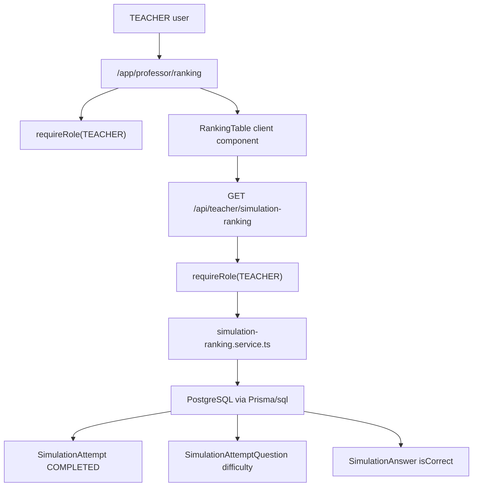

# Teacher Simulation Ranking Design

**Spec**: `.specs/features/teacher-simulation-ranking/spec.md`
**Status**: Implemented

---

## Architecture Overview

Adicionar uma area de ranking para professores em `/app/professor/ranking`. A page server-side valida `requireRole("TEACHER")` e entrega um componente client de tabela. O componente usa `@tanstack/react-table` para estado/renderizacao e chama uma API fina que tambem exige `TEACHER`. A agregacao e paginacao ficam no service do dominio para evitar carregar todo ranking no browser.



> `mermaid-studio` nao esta instalado nesta sessao, entao o diagrama fica em Mermaid inline.

---

## Code Reuse Analysis

### Existing Components to Leverage

| Component/Pattern | Location | How to Use |
| --- | --- | --- |
| Teacher route protection | `src/app/app/professor/questoes/page.tsx` | Repetir `await requireRole("TEACHER")` nas pages de professor. |
| Private app navigation | `src/app/app/layout.tsx` | Adicionar link `Ranking` visivel para role `TEACHER`. |
| Simulation persistence | `prisma/schema.prisma` | Reusar `SimulationAttempt`, `SimulationAttemptQuestion`, `SimulationAnswer` e `User`. |
| Simulation service style | `src/features/simulated-exams/simulated-exam.service.ts` | Seguir padrao de service com DTOs tipados e erros de dominio quando necessario. |
| Simulation tests | `src/features/simulated-exams/simulated-exam.service.test.ts`, `src/tests/e2e/student-simulated-exams.spec.ts` | Reusar padroes de mock Prisma e helpers E2E de simulados. |
| shadcn primitives | `src/components/ui/*` | Usar `Button`, `Card`, `Badge`, `Alert` e criar/adicionar primitivos de tabela se ainda nao existirem. |

### Integration Points

| System | Integration Method |
| --- | --- |
| Prisma/PostgreSQL | Consulta agregada por estudante sobre tentativas `COMPLETED`. |
| Better Auth roles | Page e API exigem `TEACHER`; nao confiar apenas na navegacao. |
| TanStack Table | Frontend usa `manualPagination: true`, estado controlado e `rowCount` retornado pelo backend. |
| App Router | Page server component em `/app/app/professor/ranking/page.tsx`; API route em `/app/api/teacher/simulation-ranking/route.ts`. |
| E2E DB | Criar dados deterministas e limpar tentativas antes de catalogo, conforme nota de simulados. |

---

## Data Model Strategy

### MVP sem nova coluna

Calcular `weightedScore` a partir das respostas corretas e da dificuldade copiada em `SimulationAttemptQuestion`. Isso evita migration imediata e respeita que ranking e uma leitura derivada.

Formula por estudante:

```text
weightedScore =
  sum(
    case
      when SimulationAnswer.isCorrect = true and SimulationAttemptQuestion.difficulty = EASY then 1
      when SimulationAnswer.isCorrect = true and SimulationAttemptQuestion.difficulty = HARD then 3
      when SimulationAnswer.isCorrect = true then 2
      else 0
    end
  )

completedForms = count(distinct SimulationAttempt.id where status = COMPLETED)
correctAnswers = sum(SimulationAttempt.correctCount)
wrongAnswers = sum(SimulationAttempt.wrongCount)
totalQuestions = sum(SimulationAttempt.totalQuestions)
accuracyPercent = round(correctAnswers / totalQuestions * 100, 2), or 0 when totalQuestions = 0
```

### Performance follow-up

Se o ranking ficar caro, adicionar `weightedScore` em `SimulationAttempt` no momento de finalizacao e indexar `SimulationAttempt(status, studentId, completedAt)`. Essa otimizacao nao entra no MVP porque exige migration e backfill; fica como tarefa opcional somente se a consulta real mostrar gargalo.

---

## Components

### Ranking Schemas

- **Purpose**: Validar parametros de query e sort.
- **Location**: `src/features/simulation-ranking/simulation-ranking.schema.ts`
- **Interfaces**:
  - `simulationRankingQuerySchema`
  - `type SimulationRankingQuery`
- **Rules**:
  - `page`: inteiro >= 1, default 1.
  - `pageSize`: inteiro permitido entre 10 e 100, default 20.
  - `sort`: enum restrito: `weightedScore`, `accuracyPercent`, `completedForms`, `studentName`.
  - `direction`: `asc` ou `desc`; default `desc` para metricas numericas.

### Simulation Ranking Service

- **Purpose**: Consultar ranking paginado e calcular metricas agregadas.
- **Location**: `src/features/simulation-ranking/simulation-ranking.service.ts`
- **Interfaces**:
  - `listTeacherSimulationRanking(input: SimulationRankingQuery): Promise<SimulationRankingPage>`
  - `calculateQuestionWeight(difficulty: QuestionDifficulty | null | undefined): number`
- **Dependencies**: Prisma singleton e schema de query.
- **Reuses**: Modelos de simulados existentes; estilo de DTO derivado com `Awaited<ReturnType<...>>`.
- **Implementation note**: Prisma `groupBy` provavelmente nao cobre bem soma condicional por dificuldade com joins profundos; preferir SQL parametrizado via Prisma para a consulta agregada, mantendo schema validado para sort/page/pageSize e evitando interpolacao insegura de identificadores.

### API Route

- **Purpose**: Boundary HTTP autenticada e fina para a tabela.
- **Location**: `src/app/api/teacher/simulation-ranking/route.ts`
- **Method**: `GET`
- **Query**: `page`, `pageSize`, `sort`, `direction`.
- **Response**:

```typescript
interface SimulationRankingApiResponse {
  rows: SimulationRankingRow[]
  rowCount: number
  page: number
  pageSize: number
  pageCount: number
}
```

### Teacher Ranking Page

- **Purpose**: Shell server-side autorizada e tela principal do professor.
- **Location**: `src/app/app/professor/ranking/page.tsx`
- **Dependencies**: `requireRole("TEACHER")`, `RankingTable`.
- **Reuses**: Layout visual de pages de professor com titulo, descricao e card de conteudo.

### Ranking Table

- **Purpose**: Renderizar tabela paginada, controles de pagina e estado vazio/carregamento.
- **Location**: `src/app/app/professor/ranking/_components/ranking-table.tsx`
- **Dependencies**: `@tanstack/react-table`, shadcn primitives, `fetch`.
- **TanStack decision**: usar `manualPagination: true`, `rowCount` do backend e estado controlado de `pagination`; a documentacao oficial do TanStack Table indica esse caminho para paginacao no servidor.
- **Columns**:
  - Posicao global
  - Estudante
  - Pontos
  - Formularios feitos
  - Acertos
  - Erros
  - Questoes
  - Acerto global

### Table UI Primitives

- **Purpose**: Primitivos shadcn-style para `table`, `thead`, `tbody`, `tr`, `th`, `td`, caso nao existam no projeto.
- **Location**: `src/components/ui/table.tsx`
- **Reuses**: Padrao `cn` de `src/lib/utils.ts`.

---

## Data Models

### SimulationRankingRow

```typescript
interface SimulationRankingRow {
  rank: number
  studentId: string
  studentName: string
  studentEmail: string
  weightedScore: number
  completedForms: number
  correctAnswers: number
  wrongAnswers: number
  totalQuestions: number
  accuracyPercent: number
}
```

### SimulationRankingPage

```typescript
interface SimulationRankingPage {
  rows: SimulationRankingRow[]
  rowCount: number
  page: number
  pageSize: number
  pageCount: number
}
```

---

## Error Handling Strategy

| Error Scenario | Handling | User Impact |
| --- | --- | --- |
| Usuario nao autenticado | `requireRole("TEACHER")` falha | Redirect/401 conforme padrao atual. |
| Role nao autorizada | Page/API bloqueiam antes da consulta | Estudante/admin nao ve dados agregados. |
| Query invalida | Zod rejeita parametros | API retorna erro estavel; UI mostra mensagem discreta. |
| Pagina sem linhas | Retornar `rows: []` e `rowCount` correto | Tabela mostra estado vazio ou pagina vazia. |
| Consulta agregada falha | Log/erro generico no handler | UI mostra falha ao carregar ranking. |

---

## Tech Decisions

| Decision | Choice | Rationale |
| --- | --- | --- |
| Pontuacao inicial | Derivada por consulta agregada | Evita migration/backfill ate haver necessidade real de materializacao. |
| Peso de dificuldade ausente | 2 pontos | Segue regra "sem dificuldade: media", mesmo que o schema atual exija enum. |
| Percentual global | `sum(correctCount) / sum(totalQuestions)` | Mantem consistencia com simulados finalizados e trata nao respondidas como erro. |
| Backend pagination | Obrigatoria | Pedido explicito; reduz payload e custo no browser. |
| React Table | `@tanstack/react-table` v8 | Nome atual do React Table; docs suportam manual server-side pagination com `manualPagination` e `rowCount`. |
| API namespace | `/api/teacher/simulation-ranking` | Separa superficie de professor da API student existente. |

---

## Resolved Questions

- A UI usa "Formularios" na coluna compacta, mantendo a metrica definida na spec.
- O MVP inclui apenas estudantes com pelo menos uma tentativa `COMPLETED`.
- Ordenacao controlada P2 entrou na primeira implementacao para os campos permitidos pelo schema.
