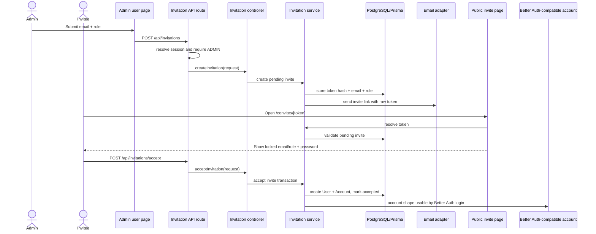

# User Invitations Design

**Spec**: `.specs/features/user-invitations/spec.md`
**Status**: Draft

---

## Architecture Overview

The feature adds a first-party invitation domain around the existing Better Auth setup. Public signup remains disabled in `src/infra/auth/server.ts`; invitation acceptance creates the same credential account shape used by `scripts/seed-users.ts`: `User` plus `Account` with `providerId: "credential"` and a Better Auth password hash.

Codebase mapping alignment:

- `.specs/codebase/ARCHITECTURE.md` confirms this should stay a small modular Next.js monolith: App Router UI, thin Route Handlers, feature logic under `src/features`, auth/session helpers under `src/infra/auth`, `src/infra/db/prisma.ts`, and local shadcn-style components.
- `.specs/codebase/CONCERNS.md` flags mutation authorization as a P1 concern. Every admin mutation in this feature must verify an authenticated `ADMIN` in the API/backend boundary, not rely on page visibility or `src/proxy.ts`.
- `.specs/codebase/CONCERNS.md` also flags E2E database state leakage. Invitation E2E work must add deterministic cleanup for invitation-created users and invitations.
- `.specs/codebase/INTEGRATIONS.md` confirms no email provider exists yet. The email layer must be an adapter boundary with deterministic dev/test behavior until a provider is selected.

Next.js 16 local docs reviewed:

- `node_modules/next/dist/docs/01-app/01-getting-started/07-mutating-data.md`: mutations must verify authentication and authorization server-side.
- `node_modules/next/dist/docs/01-app/01-getting-started/15-route-handlers.md`: Route Handlers belong under `app/` when HTTP endpoints are needed.
- `node_modules/next/dist/docs/01-app/02-guides/data-security.md`: server-side data access must stay behind explicit authorization checks.

No `mermaid-studio` skill is installed in this session, so this design uses inline Mermaid.



---

## Code Reuse Analysis

### Existing Components to Leverage

| Component            | Location                                              | How to Use                                                                                                                         |
| -------------------- | ----------------------------------------------------- | ---------------------------------------------------------------------------------------------------------------------------------- |
| Session helpers      | `src/infra/auth/session.ts`                           | Reuse `requireRole("ADMIN")` for admin page access; API routes must perform their own auth/session checks without redirect-only assumptions. |
| Better Auth config   | `src/infra/auth/server.ts`                            | Keep `disableSignUp: true`; do not open public signup.                                                                             |
| Seed account pattern | `scripts/seed-users.ts`                               | Reuse `hashPassword` and `User + Account(providerId: "credential")` account shape.                                                 |
| Prisma client        | `src/infra/db/prisma.ts`                              | Central DB access for invitation service and admin queries.                                                                        |
| shadcn components    | `src/components/ui/*`                                 | Use existing `Button`, `Input`, `Label`, `Card`, `Badge`, `Alert`, `Separator`; add `table`/`select` if needed via shadcn pattern. |
| Form handling        | `react-hook-form` + `zod` + `@hookform/resolvers/zod` | Use for invitation creation and invite acceptance form state, schemas, field validation feedback, and submission ergonomics.       |
| Existing admin route | `src/app/app/admin/page.tsx`                          | Replace placeholder admin content with user/invite management.                                                                     |
| Existing E2E helpers | `src/tests/e2e/helpers/login.ts`                      | Reuse seeded admin login for admin invite tests.                                                                                   |

### Feature Organization

Invitation domain and backend logic belongs under `src/features/invitations`, not in a top-level `src/invitations` folder. Next.js Route Handlers stay under `src/app/api` as thin adapters, route-specific UI stays close to its App Router route, and reusable shadcn primitives remain in `src/components/ui`.

```text
src/
  app/
    app/admin/
      page.tsx
      _components/
        invite-form.tsx
        invitations-table.tsx
        users-table.tsx
    api/invitations/
      route.ts
      [invitationId]/cancel/route.ts
      accept/route.ts
    convites/[token]/
      page.tsx
      _components/
        accept-invitation-form.tsx
  features/
    invitations/
      invitation.controller.ts
      invitation.controller.test.ts
      invitation-email.adapter.ts
      invitation-email.adapter.test.ts
      invitation.service.ts
      invitation.service.test.ts
      invitation.schema.ts
      invitation.schema.test.ts
      invitation-token.service.ts
      invitation-token.service.test.ts
      invitation.types.ts
```

### Integration Points

| System             | Integration Method                                                                                                                                        |
| ------------------ | --------------------------------------------------------------------------------------------------------------------------------------------------------- |
| Better Auth        | Keep public signup disabled; create accepted invited users with Better Auth password hash and credential account.                                         |
| Prisma/PostgreSQL  | Add standalone invitation model and enum; use transactions for token acceptance.                                                                          |
| Next.js App Router | Server Components for route rendering, thin Route Handlers for HTTP, and public dynamic route for invite registration.                                   |
| Email              | Add a small server-side adapter so SMTP/provider choice is isolated. Initial implementation can be environment-driven and testable without real delivery. |

---

## Components

### Invitation Model

- **Purpose**: Persist invitation lifecycle and token validation data.
- **Location**: `prisma/schema.prisma`
- **Interfaces**:
  - Prisma model `Invitation`
  - Prisma enum `InvitationStatus`
- **Dependencies**: `Role`
- **Reuses**: Existing Prisma schema conventions.

### Invitation Service

- **Purpose**: Own token generation, hashing, validation, creation, cancellation, listing, and acceptance transaction.
- **Location**: `src/features/invitations/invitation.service.ts`
- **Interfaces**:
  - `createInvitation(input): Promise<CreateInvitationResult>`
  - `resolveInvitationToken(token: string): Promise<ResolvedInvitation>`
  - `acceptInvitation(input): Promise<AcceptInvitationResult>`
  - `cancelInvitation(input): Promise<CancelInvitationResult>`
  - `listPendingInvitations(): Promise<InvitationSummary[]>`
- **Dependencies**: Prisma, Better Auth `hashPassword`, token service, email adapter.
- **Reuses**: Seed user creation pattern, Prisma client, and TypeScript aliases from `tsconfig.json`.
- **Domain errors**:
  - `EMAIL_ALREADY_REGISTERED`: invited email already has a `User` account.
  - `PENDING_INVITATION_EXISTS`: invited email already has a pending invitation.

The service must check both conditions before creating an invitation and return distinct, form-safe errors for each case. Acceptance must also reject if the invited email has become an existing user before the invite is consumed.

### Invitation Token Service

- **Purpose**: Generate raw tokens and store only hashes.
- **Location**: `src/features/invitations/invitation-token.service.ts`
- **Interfaces**:
  - `generateInvitationToken(): string`
  - `hashInvitationToken(token: string): string`
- **Dependencies**: Node crypto.
- **Reuses**: None.

### Invitation Email Adapter

- **Purpose**: Send invite links without coupling feature code to a provider.
- **Location**: `src/features/invitations/invitation-email.adapter.ts`
- **Interfaces**:
  - `sendInvitationEmail(input: { email: string; role: Role; inviteUrl: string }): Promise<void>`
- **Dependencies**: `APP_BASE_URL`, `INVITATION_EMAIL_DELIVERY`, `INVITATION_EMAIL_FROM`, optional future `SMTP_*` variables; no production provider dependency exists yet.
- **Reuses**: Existing env-driven configuration style from `.env.example` and `.env.test`.

### Invitation Schemas

- **Purpose**: Own form and API/controller validation schemas for invitation creation, cancellation, and acceptance.
- **Location**: `src/features/invitations/invitation.schema.ts`
- **Interfaces**:
  - `createInvitationSchema`
  - `cancelInvitationSchema`
  - `acceptInvitationSchema`
- **Dependencies**: `zod`
- **Reuses**: Invitation role constraints and password rules used by the service/controllers.

### Invitation Controller

- **Purpose**: Own transport-agnostic request orchestration for create, cancel, list, and accept operations.
- **Location**: `src/features/invitations/invitation.controller.ts`
- **Interfaces**:
  - `createInvitationController(input, actor): Promise<ApiResult<CreateInvitationResponse>>`
  - `cancelInvitationController(input, actor): Promise<ApiResult<CancelInvitationResponse>>`
  - `acceptInvitationController(input): Promise<ApiResult<AcceptInvitationResponse>>`
  - `listAdminInvitationsController(actor): Promise<ApiResult<AdminInvitationManagementResponse>>`
- **Dependencies**: invitation service, Zod schemas, actor role checks.
- **Reuses**: The same controller can be called by Next Route Handlers now and a different backend transport later.

### Admin User Management Page

- **Purpose**: Show users, pending invitations, create invite form, and cancel actions.
- **Location**: `src/app/app/admin/page.tsx` plus optional local components under `src/app/app/admin/_components/`
- **Interfaces**:
  - Server-rendered props from Prisma queries.
- **Data access**: Page may use read-only feature queries for initial render; mutations go through HTTP endpoints.
- **Dependencies**: `requireRole`, invitation service, shadcn UI.
- **Reuses**: Existing admin route and private layout.
- **Form handling**: Route-local client components use `react-hook-form` with `zodResolver`; submissions call invitation API endpoints, which revalidate and authorize server-side.

### Invitation API Routes

- **Purpose**: Provide HTTP endpoints while keeping backend behavior in feature controllers/services.
- **Location**:
  - `src/app/api/invitations/route.ts`
  - `src/app/api/invitations/[invitationId]/cancel/route.ts`
  - `src/app/api/invitations/accept/route.ts`
- **Interfaces**:
  - `GET /api/invitations`: list users and pending invitations for admin management.
  - `POST /api/invitations`: create invitation.
  - `POST /api/invitations/[invitationId]/cancel`: cancel pending invitation.
  - `POST /api/invitations/accept`: accept public invitation.
- **Dependencies**: `src/infra/auth/server.ts` session API, invitation controller.
- **Reuses**: Next.js Route Handler as a transport adapter only. Authorization and validation live in feature/controller/service code.

### Public Invite Registration Page

- **Purpose**: Resolve token, display locked email/role, collect password, submit acceptance.
- **Location**: `src/app/convites/[token]/page.tsx`
- **Interfaces**:
  - Dynamic route param `token`.
- **Dependencies**: invitation service, shadcn UI.
- **Reuses**: Existing login page visual vocabulary.
- **Form handling**: Password form uses `react-hook-form` with `zodResolver` for UI state and validation feedback; `POST /api/invitations/accept` remains authoritative and revalidates with Zod.

---

## Data Models

### Prisma Enum

```prisma
enum InvitationStatus {
  PENDING
  ACCEPTED
  CANCELLED
}
```

### Prisma Model

```prisma
model Invitation {
  id          String           @id @default(cuid())
  email       String
  role        Role
  tokenHash   String           @unique
  status      InvitationStatus @default(PENDING)
  acceptedAt  DateTime?
  cancelledAt DateTime?
  createdAt   DateTime         @default(now())
  updatedAt   DateTime         @updatedAt

  @@index([email])
  @@index([status])
}
```

`User` does not need new fields or relation fields. The invitation is only a signup validation artifact; after acceptance, the resulting user is identified by its own email and role.

### Domain Types

```ts
type InvitationRole = "STUDENT" | "TEACHER";

interface ResolvedInvitation {
  id: string;
  email: string;
  role: InvitationRole;
}
```

---

## Error Handling Strategy

| Error Scenario                | Handling                                   | User Impact                                       |
| ----------------------------- | ------------------------------------------ | ------------------------------------------------- |
| Invalid/malformed token       | Return generic invalid invite state.       | User sees that the invite is unavailable.         |
| Cancelled token               | Treat as unusable.                         | User cannot register.                             |
| Accepted token reuse          | Treat as unusable.                         | User cannot create duplicate account.             |
| Duplicate existing user email | Reject invite creation/acceptance with `EMAIL_ALREADY_REGISTERED`. | Admin sees that the email already has an account; invitee sees that the invite cannot be used. |
| Duplicate pending invite email | Reject invite creation with `PENDING_INVITATION_EXISTS`. | Admin sees that a pending invitation already exists and can cancel it first. |
| Email delivery failure        | Surface warning and keep invite traceable. | Admin knows the invite may need manual follow-up. |
| Non-admin mutation            | Authorize in API/controller boundary and reject. | No data mutation.                                 |

---

## Tech Decisions

| Decision                  | Choice                                                     | Rationale                                                                                                                 |
| ------------------------- | ---------------------------------------------------------- | ------------------------------------------------------------------------------------------------------------------------- |
| Token storage             | Store SHA-256 hash only; email raw token                   | Avoids storing bearer tokens in plaintext.                                                                                |
| Invite route              | `/convites/[token]`                                        | Portuguese route matches product language and keeps token out of query parsing.                                           |
| User creation             | Direct Prisma transaction using Better Auth `hashPassword` | Existing Better Auth signup is disabled by design; seed already validates this account shape.                             |
| Admin mutations           | Thin Route Handlers calling feature controllers             | Keeps backend behavior less coupled to Next.js and easier to move behind another HTTP/server runtime later.               |
| Form handling             | `react-hook-form` for editable forms                       | Keeps form state and validation feedback consistent while preserving API/controllers as the trusted mutation boundary.    |
| Form validation           | Shared `zod` schemas                                       | Keeps client feedback and server validation aligned; API/controllers must re-parse inputs and not trust client validation. |
| Email provider            | Adapter boundary first                                     | The repo has no email provider yet; adapter keeps provider choice isolated.                                               |
| Invite URL base           | `APP_BASE_URL`                                             | Keeps invitation links independent from auth-specific `BETTER_AUTH_URL` and explicit in `.env.example`/`.env.test`.       |
| Local/test email delivery | `INVITATION_EMAIL_DELIVERY=console`                        | Keeps invitation delivery deterministic without requiring SMTP credentials during development and E2E.                    |
| Feature code location     | `src/features/invitations`                                 | Keeps invitation domain logic grouped by product capability without implying strict module isolation between features.    |
| Route-local UI location   | `src/app/app/admin/_components`                            | Keeps admin-only components close to the route until they become reusable outside the admin screen.                       |
| Role choices              | Only `STUDENT` and `TEACHER` in invite UI                  | Prevents privilege escalation by invitation.                                                                              |
| Invite validity           | No expiration                                              | The product rule is simpler: invites remain usable until accepted or cancelled.                                           |
| User relation             | No relation from invitation to `User`                      | The invite only validates signup; adding user-side fields would create domain weight without product value.               |
| E2E state                 | Deterministic cleanup before invitation E2E                | Existing E2E setup seeds users but does not reset future domain data.                                                     |

---

## Security Notes

- Never include token hash in UI responses.
- Normalize email before uniqueness checks.
- Reject invitation creation with distinct errors when the email already has a user account or already has a pending invite.
- Validate role server-side even if the select only offers allowed roles.
- Use a transaction for accept flow: validate invite, create user/account, mark invite accepted.
- Ensure the `where` clause for acceptance only accepts `status = PENDING`.
- Keep `emailAndPassword.disableSignUp = true`; do not expose Better Auth public signup.
- Treat `src/proxy.ts` as an optimistic redirect only; do not use it as an authorization boundary for admin API mutations.
