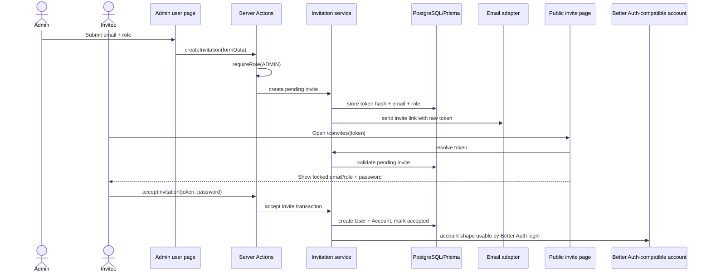

# User Invitations Design

**Spec**: `.specs/features/user-invitations/spec.md`
**Status**: Draft

---

## Architecture Overview

The feature adds a first-party invitation domain around the existing Better Auth setup. Public signup remains disabled in `src/auth/auth.ts`; invitation acceptance creates the same credential account shape used by `scripts/seed-users.ts`: `User` plus `Account` with `providerId: "credential"` and a Better Auth password hash.

Codebase mapping alignment:

- `.specs/codebase/ARCHITECTURE.md` confirms this should stay a small modular Next.js monolith: App Router UI/actions, `src/auth` session helpers, `src/infra/db/prisma.ts`, and local shadcn-style components.
- `.specs/codebase/CONCERNS.md` flags Server Action authorization as a P1 concern. Every admin mutation in this feature must call `requireRole("ADMIN")` inside the action, not rely on page visibility or `src/proxy.ts`.
- `.specs/codebase/CONCERNS.md` also flags E2E database state leakage. Invitation E2E work must add deterministic cleanup for invitation-created users and invitations.
- `.specs/codebase/INTEGRATIONS.md` confirms no email provider exists yet. The email layer must be an adapter boundary with deterministic dev/test behavior until a provider is selected.

Next.js 16 local docs reviewed:

- `node_modules/next/dist/docs/01-app/01-getting-started/07-mutating-data.md`: Server Functions/Actions must verify authentication and authorization inside every mutation.
- `node_modules/next/dist/docs/01-app/01-getting-started/15-route-handlers.md`: Route Handlers belong under `app/` when HTTP endpoints are needed.
- `node_modules/next/dist/docs/01-app/02-guides/data-security.md`: mutations should use Server Actions and re-authorize in `"use server"` files.

No `mermaid-studio` skill is installed in this session, so this design uses inline Mermaid.



---

## Code Reuse Analysis

### Existing Components to Leverage

| Component | Location | How to Use |
| --- | --- | --- |
| Session helpers | `src/auth/session.ts` | Reuse `requireRole("ADMIN")` in admin pages and admin Server Actions. |
| Better Auth config | `src/auth/auth.ts` | Keep `disableSignUp: true`; do not open public signup. |
| Seed account pattern | `scripts/seed-users.ts` | Reuse `hashPassword` and `User + Account(providerId: "credential")` account shape. |
| Prisma client | `src/infra/db/prisma.ts` | Central DB access for invitation service and admin queries. |
| shadcn components | `src/components/ui/*` | Use existing `Button`, `Input`, `Label`, `Card`, `Badge`, `Alert`, `Separator`; add `table`/`select` if needed via shadcn pattern. |
| Existing admin route | `src/app/app/admin/page.tsx` | Replace placeholder admin content with user/invite management. |
| Existing E2E helpers | `src/tests/e2e/helpers/login.ts` | Reuse seeded admin login for admin invite tests. |

### Integration Points

| System | Integration Method |
| --- | --- |
| Better Auth | Keep public signup disabled; create accepted invited users with Better Auth password hash and credential account. |
| Prisma/PostgreSQL | Add standalone invitation model and enum; use transactions for token acceptance. |
| Next.js App Router | Server Components for data loading; Server Actions for mutations; public dynamic route for invite registration. |
| Email | Add a small server-side adapter so SMTP/provider choice is isolated. Initial implementation can be environment-driven and testable without real delivery. |

---

## Components

### Invitation Model

- **Purpose**: Persist invitation lifecycle and token validation data.
- **Location**: `prisma/schema.prisma`
- **Interfaces**:
  - Prisma model `Invitation`
  - Prisma enum `InvitationStatus`
- **Dependencies**: `Role`
- **Reuses**: Existing Prisma schema conventions.

### Invitation Service

- **Purpose**: Own token generation, hashing, validation, creation, cancellation, listing, and acceptance transaction.
- **Location**: `src/invitations/invitation-service.ts`
- **Interfaces**:
  - `createInvitation(input): Promise<CreateInvitationResult>`
  - `resolveInvitationToken(token: string): Promise<ResolvedInvitation>`
  - `acceptInvitation(input): Promise<AcceptInvitationResult>`
  - `cancelInvitation(input): Promise<CancelInvitationResult>`
  - `listPendingInvitations(): Promise<InvitationSummary[]>`
- **Dependencies**: Prisma, Better Auth `hashPassword`, token utilities, email adapter.
- **Reuses**: Seed user creation pattern, Prisma client, and TypeScript aliases from `tsconfig.json`.

### Invitation Token Utilities

- **Purpose**: Generate raw tokens and store only hashes.
- **Location**: `src/invitations/invitation-tokens.ts`
- **Interfaces**:
  - `generateInvitationToken(): string`
  - `hashInvitationToken(token: string): string`
- **Dependencies**: Node crypto.
- **Reuses**: None.

### Invitation Email Adapter

- **Purpose**: Send invite links without coupling feature code to a provider.
- **Location**: `src/invitations/invitation-email.ts`
- **Interfaces**:
  - `sendInvitationEmail(input: { email: string; role: Role; inviteUrl: string }): Promise<void>`
- **Dependencies**: Environment configuration for app URL; no provider dependency exists yet.
- **Reuses**: Existing env-driven configuration style from `.env.example` and `.env.test`.

### Admin User Management Page

- **Purpose**: Show users, pending invitations, create invite form, and cancel actions.
- **Location**: `src/app/app/admin/page.tsx` plus optional local components under `src/app/app/admin/`
- **Interfaces**:
  - Server-rendered props from Prisma queries.
  - Form actions imported from `src/app/app/admin/actions.ts`.
- **Dependencies**: `requireRole`, invitation service, shadcn UI.
- **Reuses**: Existing admin route and private layout.

### Admin Invitation Actions

- **Purpose**: Mutate invitations from admin UI.
- **Location**: `src/app/app/admin/actions.ts`
- **Interfaces**:
  - `createInvitationAction(prevState, formData)`
  - `cancelInvitationAction(formData)`
- **Dependencies**: `requireRole("ADMIN")`, invitation service, `revalidatePath`.
- **Reuses**: Next.js Server Actions pattern from local docs and the authorization concern from `.specs/codebase/CONCERNS.md`.

### Public Invite Registration Page

- **Purpose**: Resolve token, display locked email/role, collect password, submit acceptance.
- **Location**: `src/app/convites/[token]/page.tsx`
- **Interfaces**:
  - Dynamic route param `token`.
  - Form action `acceptInvitationAction`.
- **Dependencies**: invitation service, shadcn UI.
- **Reuses**: Existing login page visual vocabulary.

---

## Data Models

### Prisma Enum

```prisma
enum InvitationStatus {
  PENDING
  ACCEPTED
  CANCELLED
}
```

### Prisma Model

```prisma
model Invitation {
  id          String           @id @default(cuid())
  email       String
  role        Role
  tokenHash   String           @unique
  status      InvitationStatus @default(PENDING)
  acceptedAt  DateTime?
  cancelledAt DateTime?
  createdAt   DateTime         @default(now())
  updatedAt   DateTime         @updatedAt

  @@index([email])
  @@index([status])
}
```

`User` does not need new fields or relation fields. The invitation is only a signup validation artifact; after acceptance, the resulting user is identified by its own email and role.

### Domain Types

```ts
type InvitationRole = "STUDENT" | "TEACHER";

interface ResolvedInvitation {
  id: string;
  email: string;
  role: InvitationRole;
}
```

---

## Error Handling Strategy

| Error Scenario | Handling | User Impact |
| --- | --- | --- |
| Invalid/malformed token | Return generic invalid invite state. | User sees that the invite is unavailable. |
| Cancelled token | Treat as unusable. | User cannot register. |
| Accepted token reuse | Treat as unusable. | User cannot create duplicate account. |
| Duplicate existing user email | Reject invite creation/acceptance. | Admin or invitee sees clear conflict. |
| Email delivery failure | Surface warning and keep invite traceable. | Admin knows the invite may need manual follow-up. |
| Non-admin mutation | Re-authorize in action and reject. | No data mutation. |

---

## Tech Decisions

| Decision | Choice | Rationale |
| --- | --- | --- |
| Token storage | Store SHA-256 hash only; email raw token | Avoids storing bearer tokens in plaintext. |
| Invite route | `/convites/[token]` | Portuguese route matches product language and keeps token out of query parsing. |
| User creation | Direct Prisma transaction using Better Auth `hashPassword` | Existing Better Auth signup is disabled by design; seed already validates this account shape. |
| Admin mutations | Server Actions | Next.js 16 docs recommend Server Actions for form mutations and require authz inside each action. |
| Email provider | Adapter boundary first | The repo has no email provider yet; adapter keeps provider choice isolated. |
| Role choices | Only `STUDENT` and `TEACHER` in invite UI | Prevents privilege escalation by invitation. |
| Invite validity | No expiration | The product rule is simpler: invites remain usable until accepted or cancelled. |
| User relation | No relation from invitation to `User` | The invite only validates signup; adding user-side fields would create domain weight without product value. |
| E2E state | Deterministic cleanup before invitation E2E | Existing E2E setup seeds users but does not reset future domain data. |

---

## Security Notes

- Never include token hash in UI responses.
- Normalize email before uniqueness checks.
- Validate role server-side even if the select only offers allowed roles.
- Use a transaction for accept flow: validate invite, create user/account, mark invite accepted.
- Ensure the `where` clause for acceptance only accepts `status = PENDING`.
- Keep `emailAndPassword.disableSignUp = true`; do not expose Better Auth public signup.
- Treat `src/proxy.ts` as an optimistic redirect only; do not use it as an authorization boundary for admin mutations.
